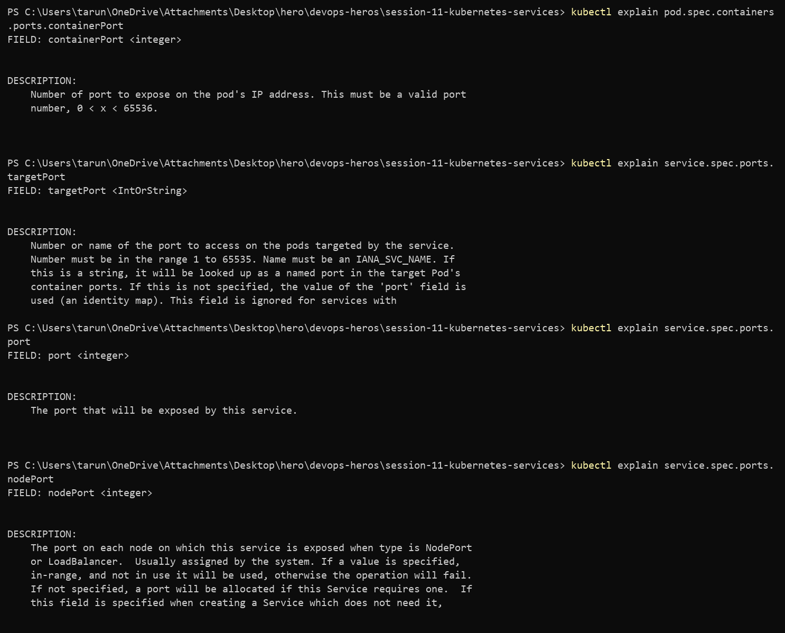
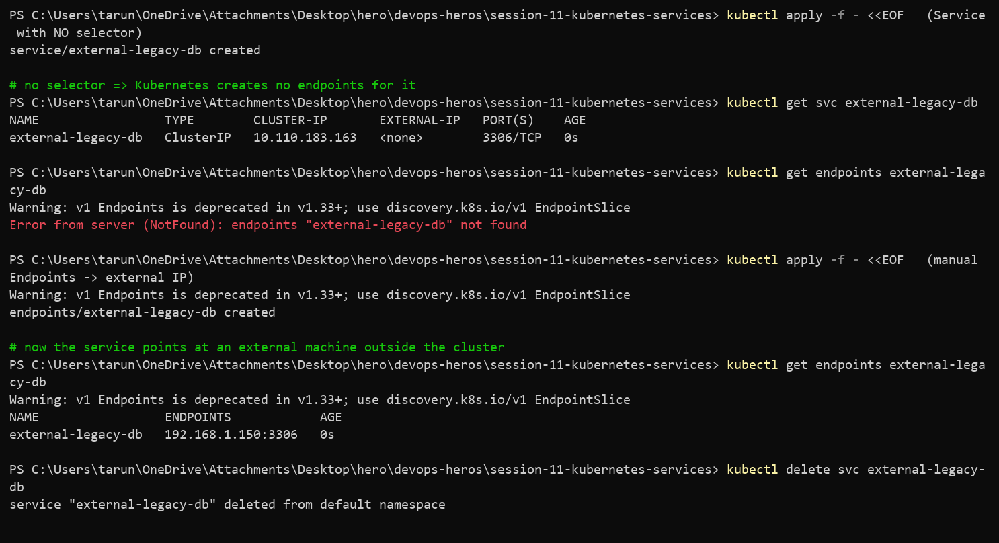
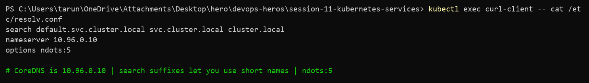
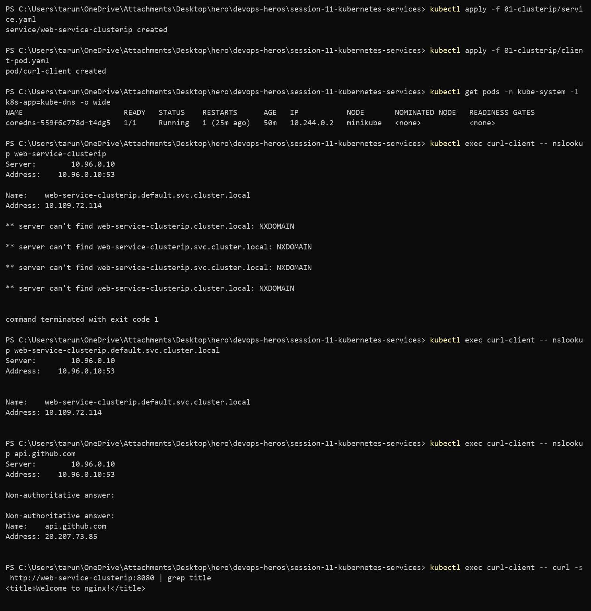
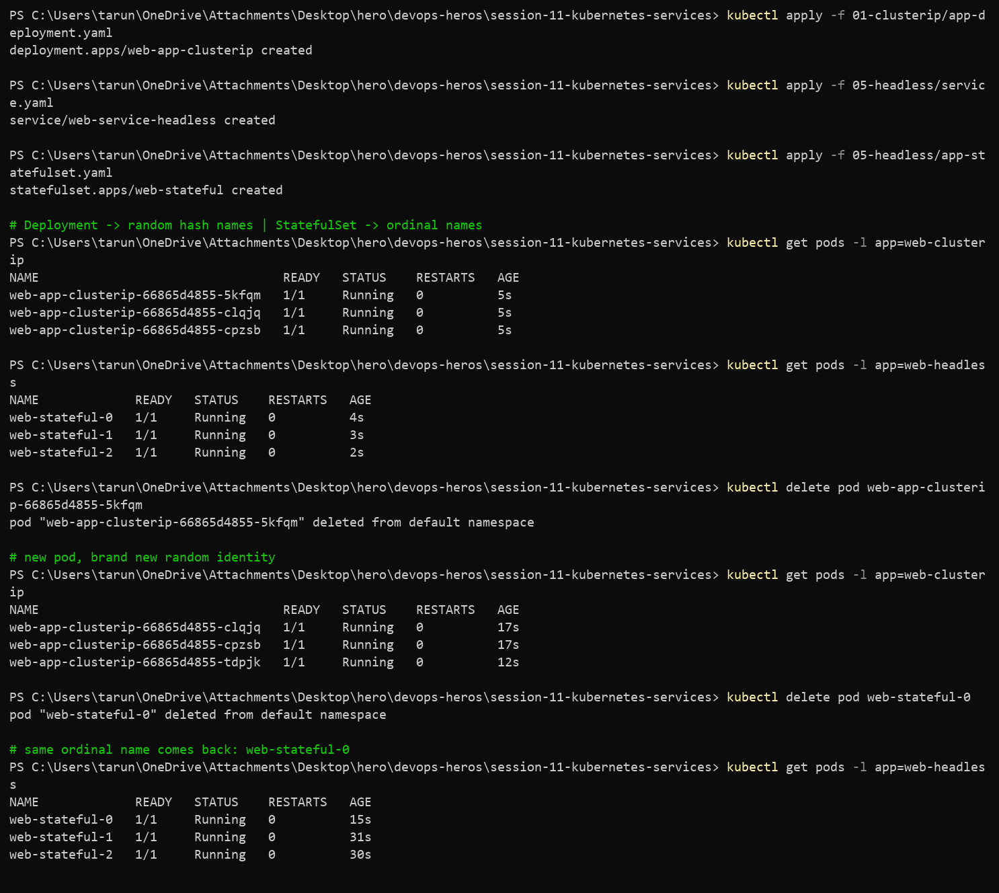
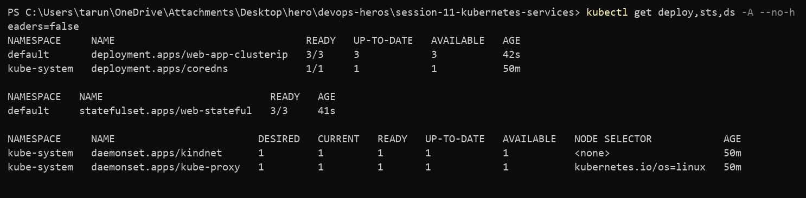
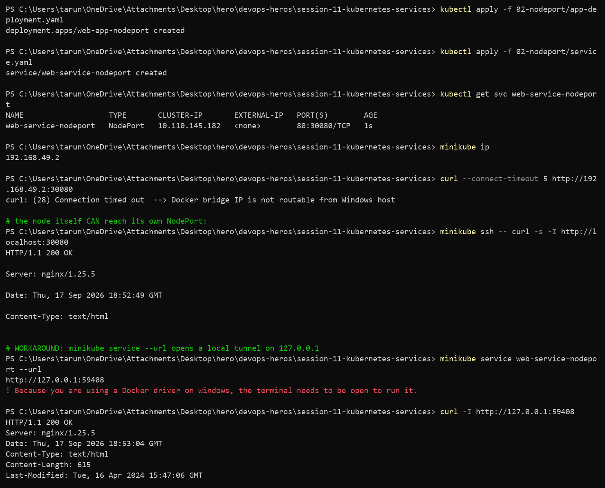

# Session 11 — Kubernetes Services & Networking

**Repo:** devops-heros / `session-11-kubernetes-services`
**Cluster:** Minikube v1.39.0 (docker driver), Kubernetes v1.37.0

---

## Task 1 — The 4 ports

```
Client ──► nodePort 30080      (open on every node IP)
              │
              ▼
           port 8080           (Service ClusterIP — what other pods call)
              │
              ▼
           targetPort 80       (the pod)
              │
              ▼
           containerPort 80    (nginx inside the container)
```

```bash
kubectl explain pod.spec.containers.ports.containerPort
kubectl explain service.spec.ports.port
kubectl explain service.spec.ports.targetPort
kubectl explain service.spec.ports.nodePort
```

**Output**

```
FIELD: containerPort <integer>
    Number of port to expose on the pod's IP address.

FIELD: targetPort <IntOrString>
    Number or name of the port to access on the pods targeted by the service.

FIELD: port <integer>
    The port that will be exposed by this service.

FIELD: nodePort <integer>
    The port on each node on which this service is exposed when type is
    NodePort or LoadBalancer.
```

| Port | Belongs to | Notes |
| --- | --- | --- |
| `containerPort` | Pod spec | documentation only — removing it does not close anything |
| `targetPort` | Service → Pod | defaults to `port` if you leave it out |
| `port` | Service ClusterIP | the in-cluster address |
| `nodePort` | every node | 30000–32767 only |



---

## Task 2 — ClusterIP (internal only)

3 replicas behind a ClusterIP on port 8080 → targetPort 80. Reachable only from inside the cluster.

```bash
kubectl apply -f 01-clusterip/app-deployment.yaml
kubectl apply -f 01-clusterip/service.yaml
kubectl get svc,endpoints web-service-clusterip
kubectl apply -f 01-clusterip/client-pod.yaml
kubectl exec -it curl-client -- curl -s http://web-service-clusterip:8080 | grep title
```


---

## Task 3 — NodePort (reachable from outside)

Opens port 30080 on every node.

```bash
kubectl apply -f 02-nodeport/app-deployment.yaml
kubectl apply -f 02-nodeport/service.yaml
kubectl get svc web-service-nodeport
minikube service web-service-nodeport --url
```


---

## Task 4 — LoadBalancer

`type: LoadBalancer` stays `<pending>` until something assigns an external IP. `minikube tunnel` fakes the cloud controller.

```bash
kubectl apply -f 03-loadbalancer/app-deployment.yaml
kubectl apply -f 03-loadbalancer/service.yaml
minikube tunnel        # separate terminal
kubectl get svc web-service-loadbalancer
```

A LoadBalancer Service is layered: it builds a ClusterIP, then a NodePort, then puts the external IP on top.


---

## Task 5 — ExternalName (DNS alias)

No selector, no endpoints, no cluster IP — just a CNAME in CoreDNS.

```bash
kubectl apply -f 04-externalname/service.yaml
kubectl get svc external-database-service
kubectl exec -it dns-test-client -- nslookup external-database-service
```

Useful for pointing an in-cluster name at an external RDS/Stripe endpoint so app config never has to change.


---

## Task 6 — Headless Service (`clusterIP: None`)

No virtual IP. DNS returns every pod IP directly, and each StatefulSet pod gets its own stable DNS name.

```bash
kubectl apply -f 05-headless/service.yaml
kubectl apply -f 05-headless/app-statefulset.yaml
kubectl exec -it headless-dns-client -- nslookup web-service-headless
kubectl exec -it headless-dns-client -- curl -s http://web-stateful-0.web-service-headless:80
```

```
Name:   web-stateful-0.web-service-headless.default.svc.cluster.local
Address: 10.244.0.29
```


---

## Task 7 — Service without a selector

Point a Service at a machine that is not in the cluster by writing the Endpoints object by hand.

```bash
# Service with no selector
kubectl apply -f - <<EOF
apiVersion: v1
kind: Service
metadata:
  name: external-legacy-db
spec:
  ports:
    - protocol: TCP
      port: 3306
      targetPort: 3306
EOF

kubectl get endpoints external-legacy-db
```

```
NAME                 TYPE        CLUSTER-IP       PORT(S)    AGE
external-legacy-db   ClusterIP   10.110.183.163   3306/TCP   0s

Error from server (NotFound): endpoints "external-legacy-db" not found
```

No selector means the endpoint controller has nothing to match, so it creates nothing. Now supply them manually:

```bash
kubectl apply -f - <<EOF
apiVersion: v1
kind: Endpoints
metadata:
  name: external-legacy-db
subsets:
  - addresses:
      - ip: 192.168.1.150
    ports:
      - port: 3306
EOF

kubectl get endpoints external-legacy-db
```

```
NAME                 ENDPOINTS            AGE
external-legacy-db   192.168.1.150:3306   0s
```

Pods can now use `external-legacy-db:3306` even though the database is a VM outside the cluster.

> Note: `v1 Endpoints` is deprecated in v1.33+ — kubectl warns and points to `discovery.k8s.io/v1 EndpointSlice`.



---

## Task 8 — FQDN & CoreDNS

```bash
kubectl get pods -n kube-system -l k8s-app=kube-dns -o wide
kubectl exec curl-client -- cat /etc/resolv.conf
```

```
NAME                       READY   STATUS    IP           NODE
coredns-559f6c778d-t4dg5   1/1     Running   10.244.0.2   minikube

search default.svc.cluster.local svc.cluster.local cluster.local
nameserver 10.96.0.10
options ndots:5
```

FQDN anatomy:

```
web-service-clusterip . default   . svc  . cluster.local
      service           namespace   type    cluster domain
```

```bash
kubectl exec curl-client -- nslookup web-service-clusterip
kubectl exec curl-client -- nslookup api.github.com
```

```
Server:   10.96.0.10
Name:     web-service-clusterip.default.svc.cluster.local
Address:  10.109.72.114
```

**Why `ndots:5` costs you latency:** any name with fewer than 5 dots is tried against every `search` suffix first. `api.github.com` has 2 dots, so the resolver asks for `api.github.com.default.svc.cluster.local`, then `...svc.cluster.local`, then `...cluster.local` — all NXDOMAIN — before finally querying the real name. That is 3 wasted round trips on every external API call. The fix in production is a trailing dot (`api.github.com.`) or a custom `dnsConfig` with `ndots: 1`.




---

## Task 9 — Deployment vs StatefulSet identity

Delete one pod from each and see what comes back.

```bash
kubectl get pods -l app=web-clusterip
kubectl get pods -l app=web-headless
kubectl delete pod web-app-clusterip-66865d4855-5kfqm
kubectl delete pod web-stateful-0
```

**Before**

```
web-app-clusterip-66865d4855-5kfqm   1/1   Running   0   5s
web-app-clusterip-66865d4855-clqjq   1/1   Running   0   5s
web-app-clusterip-66865d4855-cpzsb   1/1   Running   0   5s

web-stateful-0   1/1   Running   0   4s
web-stateful-1   1/1   Running   0   3s
web-stateful-2   1/1   Running   0   2s
```

**After**

```
web-app-clusterip-66865d4855-clqjq   1/1   Running   0   17s
web-app-clusterip-66865d4855-cpzsb   1/1   Running   0   17s
web-app-clusterip-66865d4855-tdpjk   1/1   Running   0   12s   <-- new random name

web-stateful-0   1/1   Running   0   15s   <-- same name came back
web-stateful-1   1/1   Running   0   31s
web-stateful-2   1/1   Running   0   30s
```

`5kfqm` is gone forever and `tdpjk` took its place — a Deployment pod has no identity worth keeping. `web-stateful-0` came back as `web-stateful-0`, which is what lets its DNS name and its PVC follow it.



---

## Task 10 — Deployment vs StatefulSet vs DaemonSet

```bash
kubectl get deploy,sts,ds -A
```

```
NAMESPACE     NAME                                READY   AGE
default       deployment.apps/web-app-clusterip   3/3     42s
kube-system   deployment.apps/coredns             1/1     50m

default       statefulset.apps/web-stateful       3/3     41s

kube-system   daemonset.apps/kindnet              1/1     50m
kube-system   daemonset.apps/kube-proxy           1/1     50m
```

| | Deployment | StatefulSet | DaemonSet |
| --- | --- | --- | --- |
| **Workload** | stateless APIs, web | databases, queues | node agents |
| **Pod names** | `<name>-<hash>-<rand>` | `<name>-0,1,2` | `<name>-<rand>`, one per node |
| **Identity** | disposable | stable, survives restart | tied to the node |
| **Start/stop order** | parallel | strictly 0 → 1 → 2, reverse on delete | parallel |
| **Storage** | shared PVC or emptyDir | one PVC per ordinal via `volumeClaimTemplates` | hostPath |
| **Service** | ClusterIP / NodePort / LB | **Headless** (`clusterIP: None`) | usually none |
| **Scaling** | anywhere | at the tail only | follows node count |
| **Examples** | Nginx, Flask, Node API | Kafka, MongoDB, Postgres | Fluentd, node-exporter, Cilium |

Note `kube-proxy` and `kindnet` in the output — the cluster's own networking runs as DaemonSets.



---

## Task 11 — Which Service type, and the LoadBalancer cost trap

```
Need access from outside the cluster?
│
├─ NO ──► Need to reach individual pods (Kafka, DB)?
│          ├─ YES ──► HEADLESS  (clusterIP: None)
│          └─ NO  ──► CLUSTERIP (default)
│
└─ YES ─► Pointing at an external domain (RDS, Stripe)?
           ├─ YES ──► EXTERNALNAME
           └─ NO  ──► On a cloud provider?
                       ├─ YES + HTTP(S) ─► one INGRESS behind one LOADBALANCER,
                       │                    apps stay ClusterIP
                       ├─ YES + TCP/UDP ─► LOADBALANCER directly
                       └─ NO (local/dev) ► NODEPORT
```

**The anti-pattern**

```
50 microservices × type: LoadBalancer
= 50 cloud load balancers × ~$25/month
= $1,250/month
```

**The fix**

```
Internet ──► 1 LoadBalancer ($25/mo) ──► NGINX Ingress Controller
                                              │
                          ┌───────────────────┼───────────────────┐
                          ▼                   ▼                   ▼
                    ClusterIP A         ClusterIP B         ClusterIP C
```

One LB, host/path routing at layer 7, every app stays ClusterIP. **$25/month instead of $1,250** — and you get TLS termination in one place as a bonus. Session 12 builds exactly this.

---

## Task 12 — Minikube docker driver gotcha

```bash
kubectl get svc web-service-nodeport
minikube ip
curl --connect-timeout 5 http://192.168.49.2:30080
```

```
NAME                   TYPE       CLUSTER-IP       PORT(S)        AGE
web-service-nodeport   NodePort   10.110.145.182   80:30080/TCP   1s

192.168.49.2

curl: (28) Connection timed out
```

**Why:** on Linux bare metal the node IP is a real interface on the LAN. With the docker driver on Windows/macOS, the whole node is a container and `192.168.49.2` lives on Docker's internal bridge inside a WSL2 VM. The Windows network stack has no route to it.

Proof that the NodePort itself is fine — from inside the node it works:

```bash
minikube ssh -- curl -s -I http://localhost:30080
```

```
HTTP/1.1 200 OK
Server: nginx/1.25.5
```

**Workaround 1 — `minikube service --url`** (a temporary proxy on 127.0.0.1):

```
$ minikube service web-service-nodeport --url
http://127.0.0.1:59408
! Because you are using a Docker driver on windows, the terminal needs to be open to run it.

$ curl -I http://127.0.0.1:59408
HTTP/1.1 200 OK
```

The port is random each time and the terminal must stay open — killing it kills the tunnel.

**Workaround 2 — `minikube tunnel`**, needed for `type: LoadBalancer` to get an external IP (Task 4).



---

## Reference notes in this folder

- [`service.md`](service.md) — all 5 service types in detail
- [`fqdn.md`](fqdn.md) — CoreDNS and FQDN deep dive
