# Session 12 — Ingress, ConfigMaps & Secrets

**Repo:** devops-heros / `session-12-ingress-configmaps-secrets`
**Cluster:** Minikube v1.39.0 (docker driver), Kubernetes v1.37.0, ingress-nginx v1.15.1

---

## Task 1 — ConfigMap

Pull environment settings out of the image so the same image runs in dev and prod.

```bash
kubectl apply -f 01-configmap/app-config.yaml
kubectl describe configmap yatri-app-config
kubectl get configmap yatri-app-config -o jsonpath='{.data.ENVIRONMENT}'
```

**Output**

```
configmap/yatri-app-config created

NAME               DATA   AGE
yatri-app-config   5      0s

Data
====
DEFAULT_CURRENCY:  INR
ENVIRONMENT:       production
LOG_LEVEL:         INFO
MAX_BOOKING_DAYS:  30
PORT:              5000

$ kubectl get configmap yatri-app-config -o jsonpath='{.data.ENVIRONMENT}'
production
```

`describe` prints ConfigMap values in plain text — that is the whole difference from a Secret.

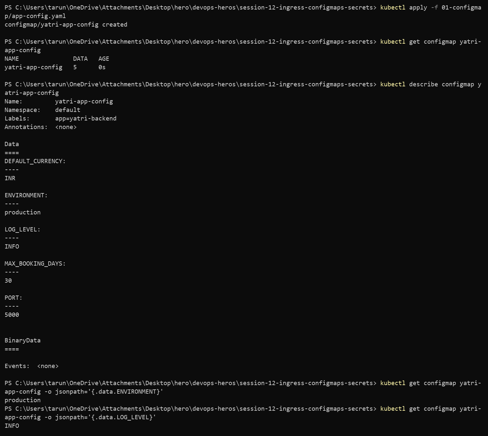

---

## Task 2 — Updating a ConfigMap does not update running pods

```bash
kubectl patch configmap yatri-app-config --type merge -p '{"data":{"ENVIRONMENT":"staging"}}'
kubectl exec deploy/yatri-backend -- env | grep ENVIRONMENT
kubectl rollout restart deployment/yatri-backend
kubectl exec deploy/yatri-backend -- env | grep ENVIRONMENT
```

**Output**

```
configmap/yatri-app-config patched

# the ConfigMap really did change
$ kubectl get configmap yatri-app-config -o jsonpath='{.data.ENVIRONMENT}'
staging

# but the running pod still says:
ENVIRONMENT=production

$ kubectl rollout restart deployment/yatri-backend
deployment.apps/yatri-backend restarted
deployment "yatri-backend" successfully rolled out

# new pods:
ENVIRONMENT=staging
```

Environment variables are injected **once**, when the container starts. Patching the ConfigMap afterwards changes nothing for a live process, and there is no error to tell you — the app just keeps running on stale config.

`rollout restart` replaces the pods one at a time, so the config refresh costs zero downtime.

> Mounted as a **volume** instead of `env`, a ConfigMap does update in place (~60s via kubelet sync) — but the app still has to re-read the file.

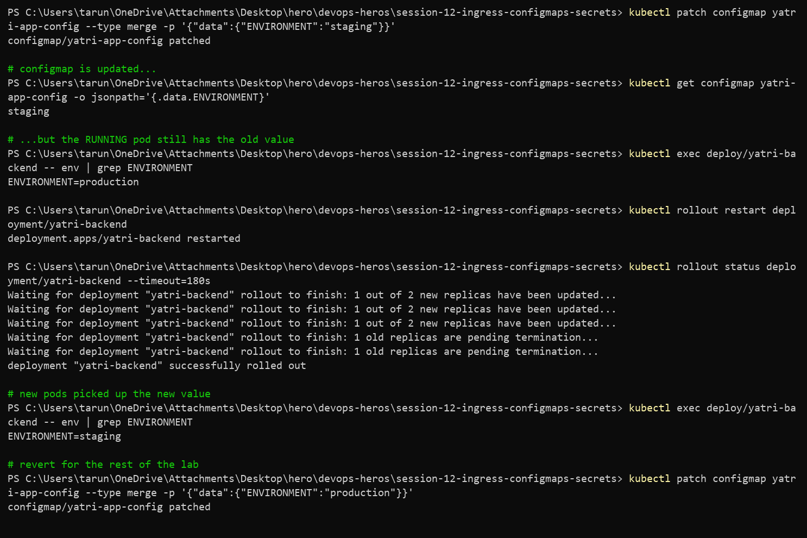

---

## Task 3 — Secret & base64

```bash
kubectl apply -f 02-secret/db-secret.yaml
kubectl describe secret yatri-db-secret
kubectl get secret yatri-db-secret -o jsonpath='{.data.POSTGRES_PASSWORD}' | base64 --decode
```

**Output**

```
NAME              TYPE     DATA   AGE
yatri-db-secret   Opaque   3      0s

Data
====
POSTGRES_DB:        19 bytes
POSTGRES_PASSWORD:  14 bytes
POSTGRES_USER:      11 bytes

$ kubectl get secret yatri-db-secret -o jsonpath='{.data.POSTGRES_PASSWORD}' | base64 --decode
secretpassword
$ kubectl get secret yatri-db-secret -o jsonpath='{.data.POSTGRES_USER}' | base64 --decode
yatri_admin
```

`describe` hides the values and only shows byte counts — but one jsonpath + `base64 --decode` prints the password. **Base64 is encoding, not encryption.** Anyone with `get secret` RBAC can read it, and by default etcd stores it unencrypted.

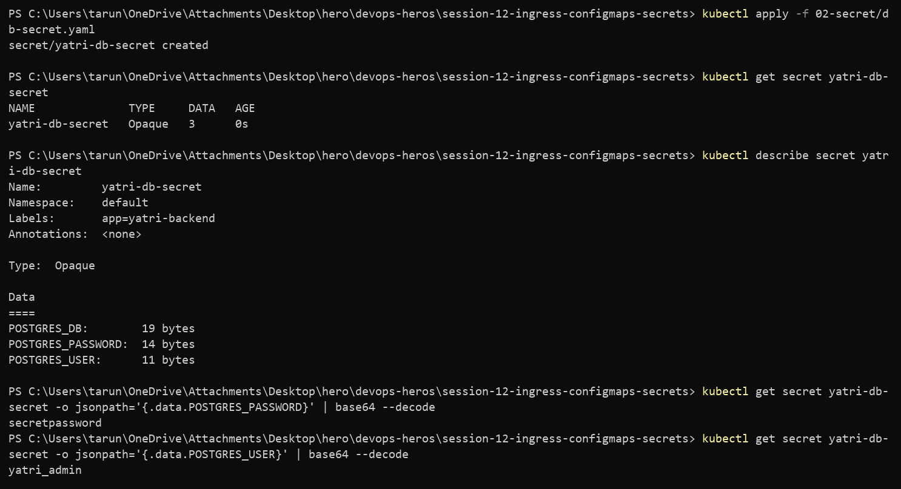

---

## Task 4 — The trailing newline bug

```bash
echo "secretpassword"    | xxd
echo -n "secretpassword" | xxd
```

**Output**

```
# WRONG
00000000: 7365 6372 6574 7061 7373 776f 7264 0a    secretpassword.
                                             ^^ the extra byte
c2VjcmV0cGFzc3dvcmQK

# RIGHT
00000000: 7365 6372 6574 7061 7373 776f 7264       secretpassword
c2VjcmV0cGFzc3dvcmQ=

Wrong (with newline): c2VjcmV0cGFzc3dvcmQK
Right (no newline):   c2VjcmV0cGFzc3dvcmQ=
```

`echo` appends `0x0a`. The base64 ends in `K` instead of `=`, and the app receives `secretpassword\n` — Postgres rejects it as a wrong password while the Secret looks perfectly fine in `kubectl describe`. Hours get lost on this one.

Always `echo -n`, or better `printf '%s'`.

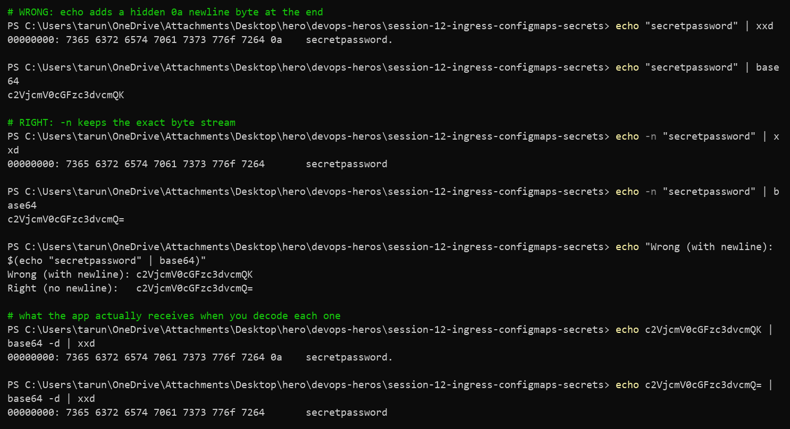

---

## Task 5 — How secrets are done for real

```bash
kubectl get crds | grep -i secret || echo "Standard native secrets in use"
```

```
Standard native secrets in use
```

This cluster has no secret-operator CRDs — plain native Secrets, fine for a lab, not for production.

**Why committing Secret YAML to Git is a problem**

- base64 is not encryption, so the password is effectively plaintext in the repo
- git history keeps it forever — deleting the file later does not help
- anyone with repo read access has prod credentials
- no rotation, no audit trail of who read what

**What production actually does**

```
AWS Secrets Manager / Azure Key Vault / HashiCorp Vault
                    │
                    ▼
        External Secrets Operator (ESO)
        watches an ExternalSecret CR, pulls the value
                    │
                    ▼
        Kubernetes Secret (created in-cluster, never in Git)
                    │
                    ▼
        Pod  (env or mounted volume)
```

Only the *reference* is committed — the secret name and which key to pull. ESO re-syncs on an interval, so rotating in Vault rotates in the cluster.

**CI/CD:** GitHub Actions secrets or Azure DevOps variable groups are injected at deploy time as masked env vars. The manifest repo holds a placeholder; the value only exists inside the pipeline run.

---

## Task 6 — ConfigMap + Secret in the same pod

`04-full-demo/backend.yaml` uses both styles: `envFrom` pulls in the whole ConfigMap, `valueFrom.secretKeyRef` picks individual secret keys.

```bash
kubectl apply -f 04-full-demo/configmap.yaml
kubectl apply -f 04-full-demo/secret.yaml
kubectl apply -f 04-full-demo/backend.yaml
kubectl exec -it deploy/yatri-backend -- env | grep -E "ENVIRONMENT|LOG_LEVEL|POSTGRES|DEFAULT_CURRENCY"
```

**Output**

```
deployment.apps/yatri-backend created
service/yatri-backend-service created
deployment "yatri-backend" successfully rolled out

DEFAULT_CURRENCY=INR
ENVIRONMENT=production
LOG_LEVEL=INFO
POSTGRES_USER=yatri_admin
POSTGRES_PASSWORD=secretpassword
POSTGRES_DB=yatri_production_db
```

Both sources land in the same environment. Inside the container there is no way to tell which value came from a ConfigMap and which from a Secret.

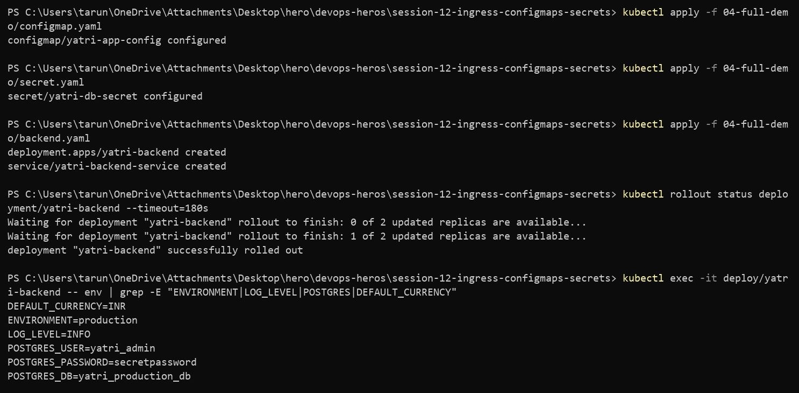

---

## Task 7 — Ingress resource vs Ingress Controller

```bash
kubectl api-resources | grep -i ingress
```

```
ingressclasses   networking.k8s.io/v1   false   IngressClass
ingresses   ing   networking.k8s.io/v1   true    Ingress
```

| | Ingress **resource** | Ingress **Controller** |
| --- | --- | --- |
| What it is | a YAML object — hosts, paths, TLS refs | a pod running nginx/traefik/envoy |
| Does it route traffic? | no | yes |
| Where it lives | etcd | `ingress-nginx` namespace |
| If it is missing | rules exist but do nothing | nothing to configure |

The API type always exists in Kubernetes — that is why creating an Ingress never errors even with no controller installed. It just silently never gets an ADDRESS. The controller watches the API for Ingress objects, regenerates `nginx.conf`, and reloads.

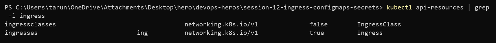

---

## Task 8 — Enable the NGINX Ingress Controller

```bash
minikube addons enable ingress
kubectl wait --namespace ingress-nginx \
  --for=condition=ready pod \
  --selector=app.kubernetes.io/component=controller --timeout=180s
kubectl get service -n ingress-nginx
```

**Output**

```
* The 'ingress' addon is enabled

NAME                                       READY   STATUS      RESTARTS   AGE
ingress-nginx-admission-create-bnmtr       0/1     Completed   0          30s
ingress-nginx-admission-patch-9njx8        0/1     Completed   0          30s
ingress-nginx-controller-d7cd8c989-g996g   1/1     Running     0          41s

pod/ingress-nginx-controller-d7cd8c989-g996g condition met

NAME                                 TYPE        CLUSTER-IP       PORT(S)
ingress-nginx-controller             NodePort    10.109.139.149   80:32191/TCP,443:31670/TCP
ingress-nginx-controller-admission   ClusterIP   10.97.41.21      443/TCP
```

The two `Completed` jobs are the admission webhook certificate setup — they are supposed to finish and stay at `0/1`.

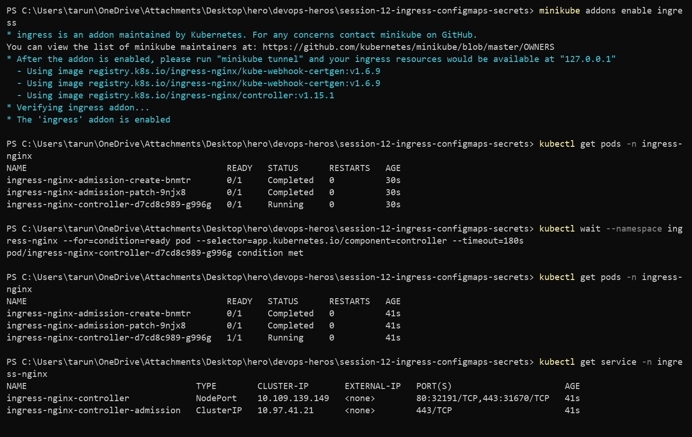

---

## Task 9 — Map the domain locally

```bash
minikube ip
echo "192.168.49.2  yatri.local" >> /etc/hosts
grep yatri.local /etc/hosts
```

```
192.168.49.2

192.168.49.2  yatri.local
```

On Windows the real file is `C:\Windows\System32\drivers\etc\hosts` and it needs an elevated shell:

```powershell
Start-Process notepad -Verb RunAs -ArgumentList C:\Windows\System32\drivers\etc\hosts
```

**But on the docker driver that entry still will not work** — `192.168.49.2` is not routable from Windows (Session 11, Task 12). So the tests below reach the controller through a port-forward and set the hostname with a `Host:` header or `curl --resolve`, which produces the exact same request nginx would see:

```bash
kubectl port-forward -n ingress-nginx svc/ingress-nginx-controller 8080:80
curl -H "Host: yatri.local" http://127.0.0.1:8080/
```

`minikube tunnel` is the other option if you want the hosts-file entry to work for real.

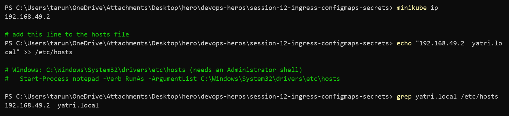

---

## Task 10 — Path-based routing

`/` → frontend, `/api/*` → backend, one host.

```bash
kubectl apply -f 04-full-demo/frontend.yaml
kubectl apply -f 04-full-demo/ingress.yaml
kubectl describe ingress yatri-ingress
```

**Output**

```
NAME            CLASS   HOSTS         ADDRESS        PORTS   AGE
yatri-ingress   nginx   yatri.local   192.168.49.2   80      21s

Rules:
  Host         Path            Backends
  yatri.local
               /api(/|$)(.*)   yatri-backend-service:80  (10.244.0.83:5000,10.244.0.84:5000)
               /               yatri-frontend-service:80 (10.244.0.86:80,10.244.0.85:80)
Annotations:   nginx.ingress.kubernetes.io/rewrite-target: /$2
               nginx.ingress.kubernetes.io/ssl-redirect: false
               nginx.ingress.kubernetes.io/use-regex: true
```

```bash
curl -s -H "Host: yatri.local" http://127.0.0.1:8080/ | grep -i "<title>"
curl -s -H "Host: yatri.local" http://127.0.0.1:8080/api/
```

```
<title>Welcome to nginx!</title>

Yatri Backend API
=================
ENVIRONMENT     : production
LOG_LEVEL       : INFO
DEFAULT_CURRENCY: INR
POSTGRES_USER   : yatri_admin
POSTGRES_DB     : yatri_production_db
```

Two different services, one hostname, one IP. The backend response is the ConfigMap and Secret from Tasks 1–6 coming out the other end.

**On `rewrite-target: /$2`:** the path regex `/api(/|$)(.*)` puts everything after `/api/` in capture group 2, and the rewrite forwards only that. So `/api/bookings` reaches the backend as `/bookings` — the backend does not need to know it is mounted under `/api`.

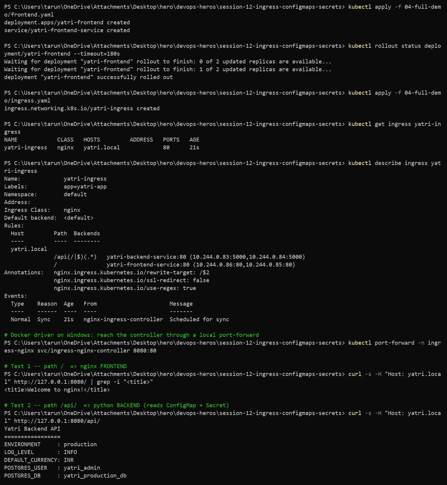

---

## Task 11 — Host-based routing

Two hostnames, same cluster IP, different services.

```bash
curl -sk --resolve portal.campus.local:8443:127.0.0.1 https://portal.campus.local:8443/ | grep -i title
curl -sk --resolve api.campus.local:8443:127.0.0.1 https://api.campus.local:8443/api/
```

**Output**

```
<title>Welcome to nginx!</title>

Yatri Backend API
=================
ENVIRONMENT     : production
POSTGRES_USER   : yatri_admin
POSTGRES_DB     : yatri_production_db
```

Same IP, same port, same TCP connection target — nginx splits them purely on the `Host` header.

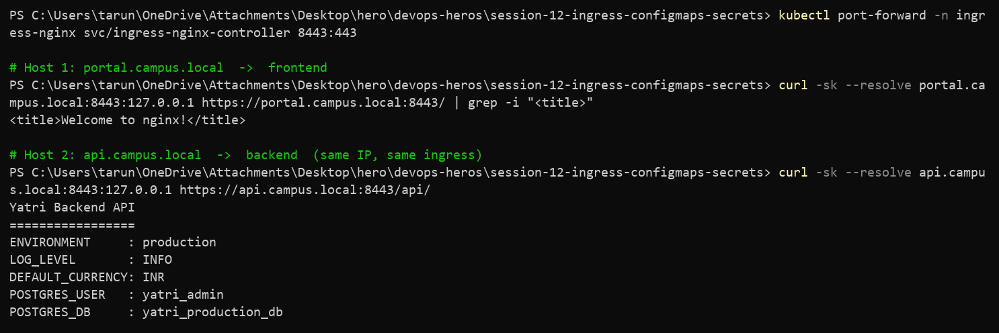

---

## Task 12 — Hybrid routing (host + path together)

```bash
kubectl apply -f 03-ingress/ingress-tls.yaml
kubectl describe ingress campus-ingress-tls
```

**Output**

```
NAME                 CLASS   HOSTS                                  ADDRESS        PORTS
campus-ingress-tls   nginx   portal.campus.local,api.campus.local   192.168.49.2   80, 443

TLS:
  campus-tls-cert terminates portal.campus.local,api.campus.local
Rules:
  Host                 Path             Backends
  portal.campus.local
                       /()(.*)          yatri-frontend-service:80  (10.244.0.86:80,10.244.0.85:80)
  api.campus.local
                       /api(/|$)(.*)    yatri-backend-service:80   (10.244.0.83:5000,10.244.0.84:5000)
```

One manifest doing host routing *and* path routing, with TLS on both hosts. This is the pattern that replaces 50 cloud load balancers with one.

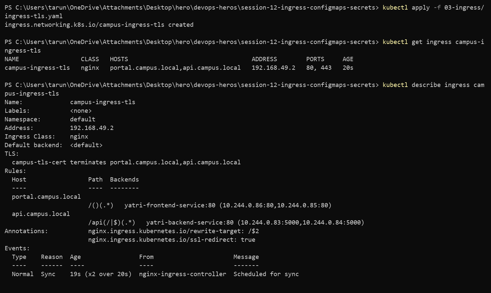

---

## Task 13 — TLS termination

```bash
openssl req -x509 -nodes -days 365 -newkey rsa:2048 \
  -keyout tls.key -out tls.crt \
  -subj "/CN=campus.local/O=CampusDevOps" \
  -addext "subjectAltName=DNS:campus.local,DNS:portal.campus.local,DNS:api.campus.local"

kubectl create secret tls campus-tls-cert --cert=tls.crt --key=tls.key
```

**Output**

```
$ openssl x509 -in tls.crt -noout -subject -ext subjectAltName
subject=CN=campus.local, O=CampusDevOps
X509v3 Subject Alternative Name:
    DNS:campus.local, DNS:portal.campus.local, DNS:api.campus.local

secret/campus-tls-cert created

NAME              TYPE                DATA   AGE
campus-tls-cert   kubernetes.io/tls   2      0s
```

Type is `kubernetes.io/tls`, not `Opaque` — the keys must be exactly `tls.crt` and `tls.key`, which is why `kubectl create secret tls` exists instead of writing the YAML by hand.

### Gotcha hit during this task

The first cert was generated with only `-subj "/CN=campus.local"`. HTTPS still answered, but with the wrong certificate:

```
subject=O=Acme Co, CN=Kubernetes Ingress Controller Fake Certificate
```

Controller logs explained it:

```
Unexpected error validating SSL certificate "default/campus-tls-cert" for server "portal.campus.local":
x509: certificate is not valid for any names, but wanted to match portal.campus.local
Using default certificate
```

Modern ingress-nginx ignores CN and requires a **SAN** entry per host. Adding `-addext "subjectAltName=..."` fixed it — and note it fails *silently*, falling back to the fake cert instead of erroring.

### Verify

```bash
openssl s_client -connect 127.0.0.1:8443 -servername portal.campus.local </dev/null \
  | openssl x509 -noout -subject -issuer -dates
```

```
subject=CN=campus.local, O=CampusDevOps
issuer=CN=campus.local, O=CampusDevOps
notBefore=Sep 17 19:02:18 2026 GMT
notAfter=Sep 17 19:02:18 2027 GMT
```

Self-signed, so subject == issuer. Browsers will warn; `curl -k` skips the check.

```
$ curl -s -o /dev/null -D - -H "Host: portal.campus.local" http://127.0.0.1:8080/
HTTP/1.1 308 Permanent Redirect
```

`ssl-redirect: true` sends plain HTTP to HTTPS. TLS terminates at the ingress — traffic from there to the pods is plain HTTP inside the cluster.

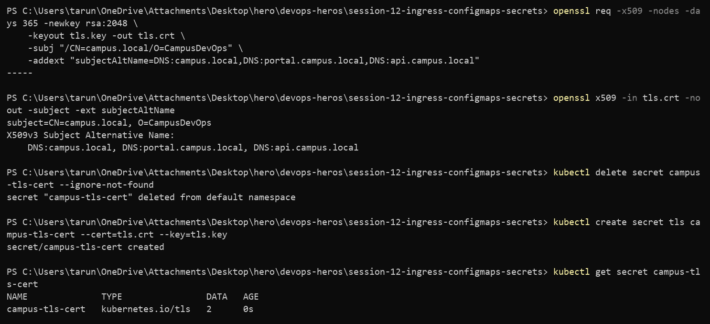
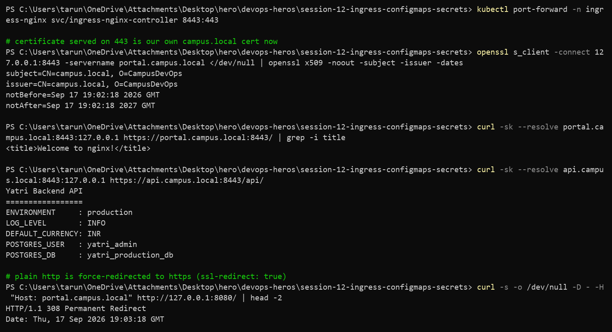

---

## Task 14 — Full stack automation

`04-full-demo/backend.yaml` and `frontend.yaml` each hold a Deployment **and** a Service in one file, separated by `---`. Kubernetes reads it as two documents, so one `kubectl apply` creates both, and one `kubectl delete -f` removes both.

```bash
bash 04-full-demo/run-demo.sh
```

**Output**

```
[INFO] Step 1: Enabling NGINX Ingress Controller on Minikube...
[INFO] Step 2: Applying ConfigMap (plain-text configuration)...
[INFO] Step 3: Applying Secret (sensitive database credentials)...
[INFO] Step 4: Deploying Frontend (Nginx) + ClusterIP Service...
[INFO] Step 5: Deploying Backend (Python HTTP server) + ClusterIP Service...
[INFO] Step 6: Waiting for all pods to reach Running state...
deployment "yatri-frontend" successfully rolled out
deployment "yatri-backend" successfully rolled out
[INFO] Step 7: Applying Ingress routing rules...
[INFO] Step 8: Summary of deployed resources...

NAME               DATA   AGE
yatri-app-config   5      7m55s
NAME              TYPE     DATA   AGE
yatri-db-secret   Opaque   3      7m54s
NAME                             READY   STATUS    RESTARTS   AGE
yatri-frontend-ddcfc4b5f-lzct4   1/1     Running   0          6m51s
yatri-frontend-ddcfc4b5f-wzhdm   1/1     Running   0          6m51s
NAME                     TYPE        CLUSTER-IP      PORT(S)   AGE
yatri-frontend-service   ClusterIP   10.110.110.23   80/TCP    6m51s
NAME            CLASS   HOSTS         ADDRESS        PORTS   AGE
yatri-ingress   nginx   yatri.local   192.168.49.2   80      6m50s

[INFO] Step 9: Adding yatri.local to /etc/hosts (requires sudo)...
[INFO] yatri.local already exists in /etc/hosts. Skipping.
[INFO] Demo is READY.
```

The script is ordered on purpose — ConfigMap and Secret go in before the Deployments, because a pod referencing a missing ConfigMap sits in `CreateContainerConfigError`.

### Teardown

```bash
bash 04-full-demo/cleanup.sh
kubectl get ingress yatri-ingress || echo "Ingress deleted"
```

```
[INFO] Deleting Ingress...
ingress.networking.k8s.io "yatri-ingress" deleted from default namespace
[INFO] Deleting Backend Deployment and Service...
deployment.apps "yatri-backend" deleted from default namespace
service "yatri-backend-service" deleted from default namespace
[INFO] Deleting Frontend Deployment and Service...
deployment.apps "yatri-frontend" deleted from default namespace
service "yatri-frontend-service" deleted from default namespace
[INFO] Deleting Secret...
[INFO] Deleting ConfigMap...
[INFO] All demo resources removed.

Error from server (NotFound): ingresses.networking.k8s.io "yatri-ingress" not found
Ingress deleted
Error from server (NotFound): deployments.apps "yatri-backend" not found
Deployments deleted
```

Cleanup runs in reverse order — ingress first, config last — so nothing is left referencing a deleted object.

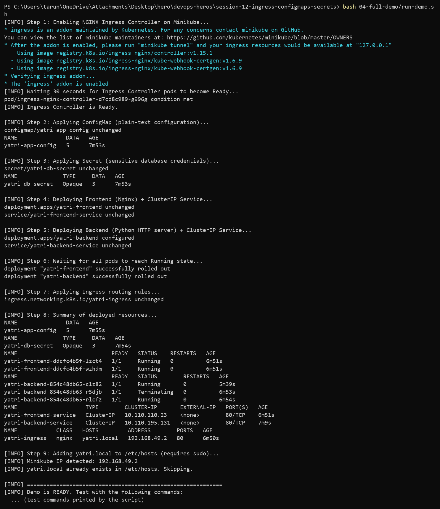
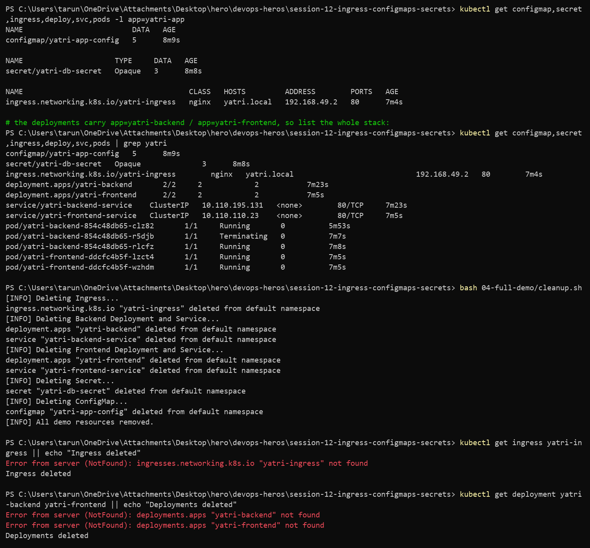

---

## Reference notes in this folder

- [`lab.md`](lab.md) — full lab walkthrough
- [`troubleshooting/secret-base64-gotcha.md`](troubleshooting/secret-base64-gotcha.md) — the newline bug
