# Session 13 — Kubernetes Storage, HPA & Probes

Cluster: Minikube (docker driver), metrics-server addon enabled.

Task 1 notes (emptyDir, hostPath, PV, PVC, StorageClass, dynamic provisioning): [01-kubernetes-volumes/README.md](./01-kubernetes-volumes/README.md)

---

## 1. emptyDir — storage dies with the Pod

```powershell
kubectl apply -f 01-volumes/emptydir-pod.yaml
kubectl exec emptydir-demo -- sh -c 'echo hello-from-emptydir > /data/note.txt'
kubectl exec emptydir-demo -- cat /data/note.txt
```
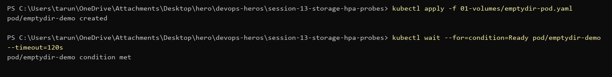
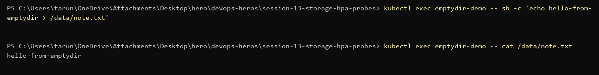

Delete the Pod and recreate it — the file is gone, because emptyDir lives only as long as the Pod.

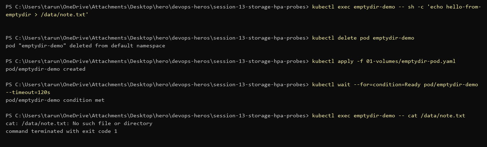

## 2. hostPath — data stays on the node

```powershell
kubectl apply -f 01-volumes/hostpath-pod.yaml
```
File written to `/data` survives a Pod delete because it lives in `/tmp/hostpath-data` on the minikube node.

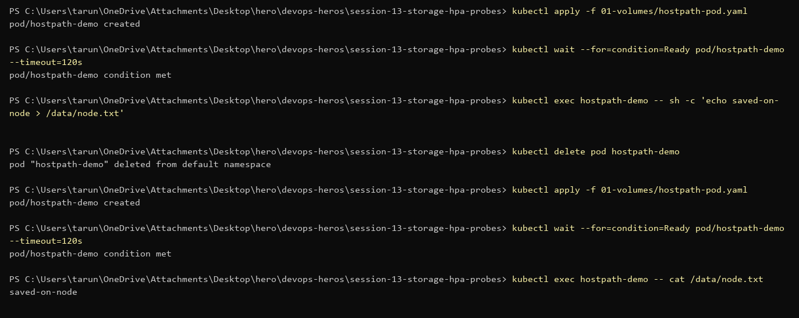

## 3. PersistentVolume + PersistentVolumeClaim

```powershell
kubectl apply -f 02-persistent-storage/pv.yaml -f 02-persistent-storage/pvc.yaml
kubectl get pv,pvc
```
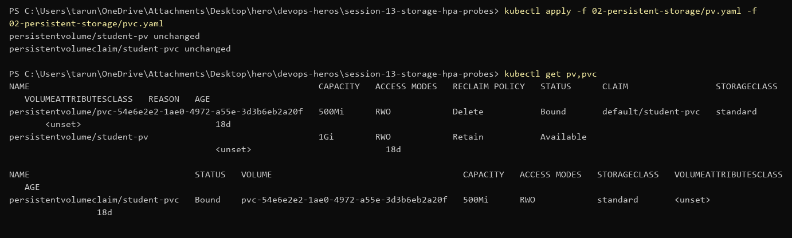

Note: `student-pvc` has no `storageClassName`, so minikube's default `standard` class provisioned a new PV for it and the manual `student-pv` stayed `Available`.

Pod writes to the PVC, gets deleted, new Pod still reads the file:

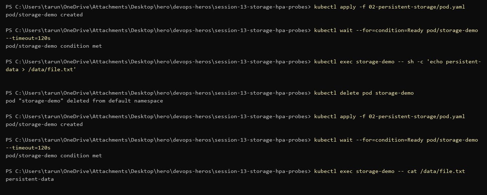

## 4. StorageClass — dynamic provisioning

```powershell
kubectl get storageclass
kubectl apply -f 03-storageclass/pvc.yaml
kubectl get pvc dynamic-pvc
```
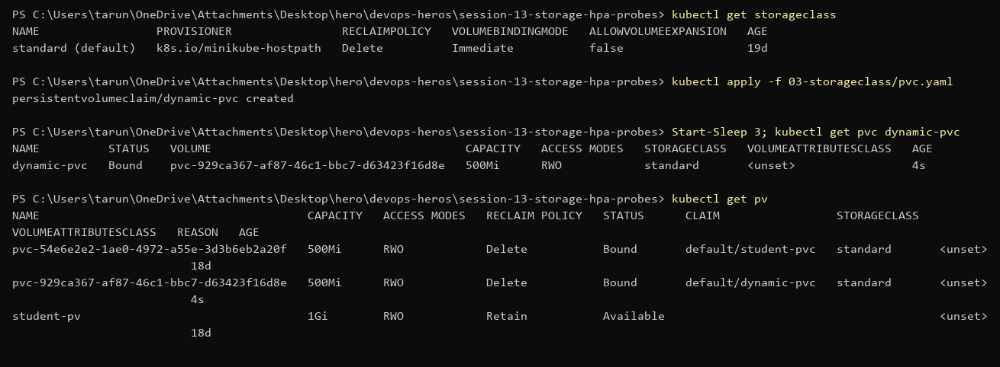

## 5. Probes

```powershell
kubectl apply -f 05-probes/
kubectl get pods liveness-demo readiness-demo startup-demo
```
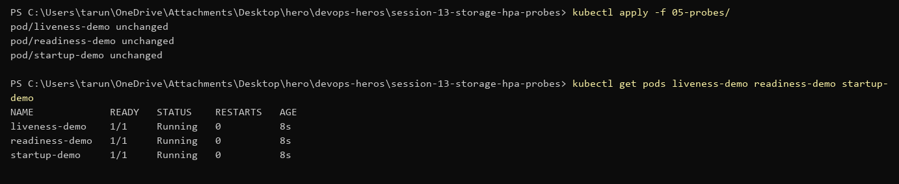
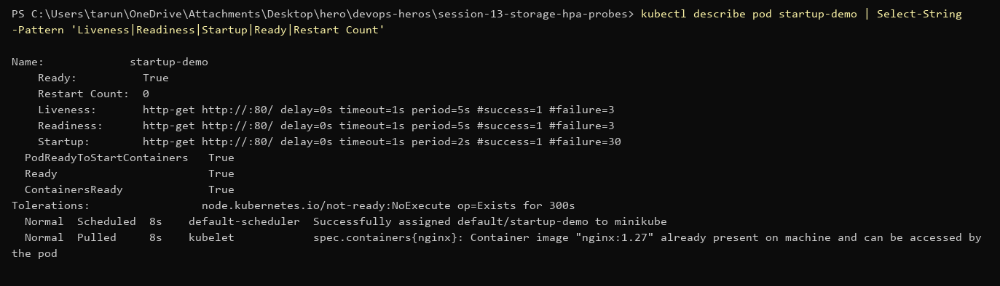

Liveness failure: deleted nginx's `index.html` → `/` returns 403 → probe fails 3 times → kubelet restarts the container (fresh filesystem, file is back).

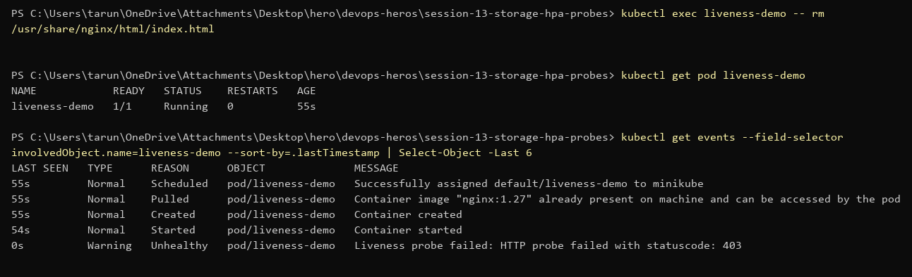
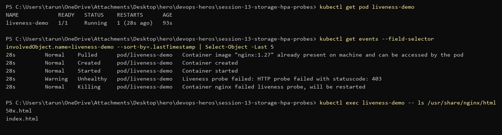

---

## Mini Project — Production-ready web app (`mini-project/`)

PVC + 2-replica nginx Deployment with startup/readiness/liveness probes + ClusterIP Service + HPA (2–5 pods, 50% CPU).

```powershell
kubectl apply -f namespace.yaml
kubectl apply -f pvc.yaml
kubectl apply -f deployment.yaml
kubectl apply -f service.yaml
kubectl apply -f hpa.yaml
kubectl get pvc,pods,svc,hpa -n production-webapp
```
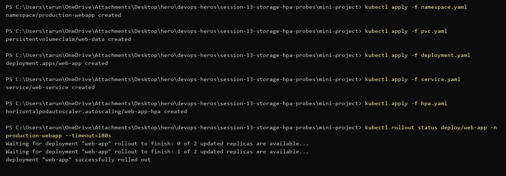
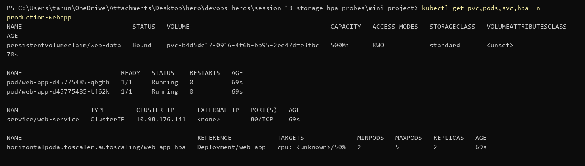

### Task 1 — Storage persistence

Wrote `Student: Tarun` to `/data/student.txt`, deleted the Pod, read it from the new Pod.

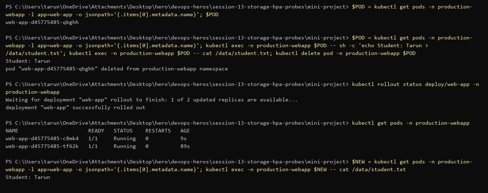

### Task 3 — HPA scaling

Ran 3 busybox load generators hitting `web-service`. CPU went to 67% (target 50%) and HPA scaled 2 → 3.

```powershell
kubectl run load-generator-1 -n production-webapp --image=busybox:1.36 --restart=Never -- /bin/sh -c "while true; do wget -q -O- http://web-service; done"
kubectl get hpa -n production-webapp -w
```
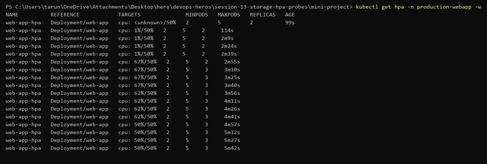
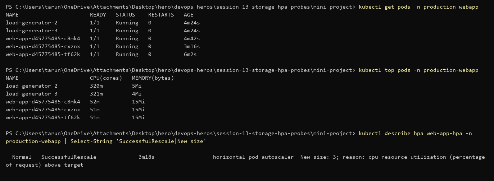

### Bonus — Readiness gating

Changed readiness path to `/does-not-exist`: Pods stay `Running` but `0/1` READY and the Service has no endpoints, so no traffic reaches them. Re-applied the original YAML to fix.

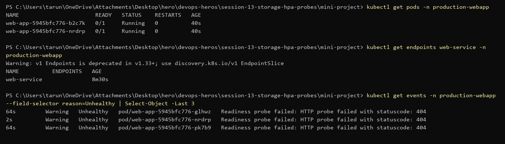
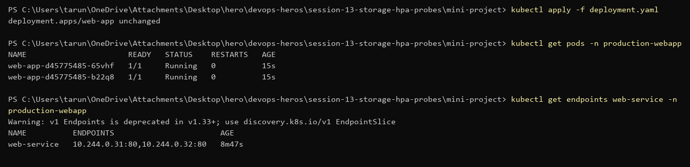
