# More Troubleshooting — Commands + Issues

Covers what the homework lists that labs 01–09 didn't: `kubectl explain`, `kubectl top`, ContainerCreating, a configuration issue, and a pod networking issue. Then a 6-step summary for every issue in this session.

All output is from my Minikube cluster.

---

## kubectl explain

Shows the schema of any field straight from the API server — no need to search docs for YAML.

```powershell
kubectl explain pod.spec.containers.livenessProbe
kubectl explain deployment.spec.strategy --recursive
```
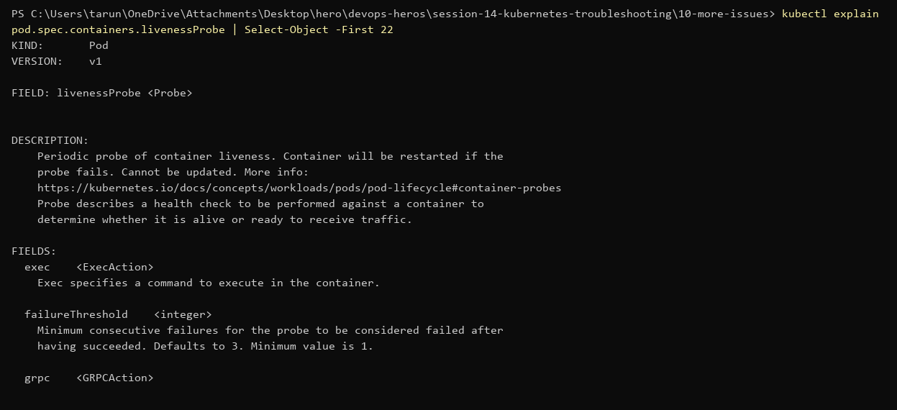
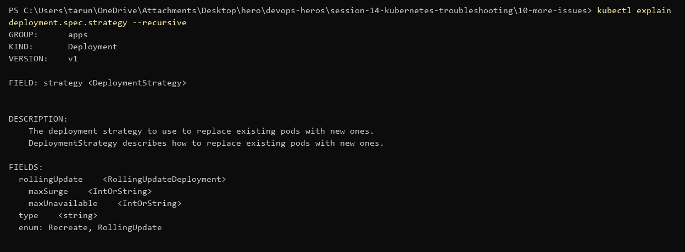

## kubectl top

Live CPU/memory per node and per pod (needs metrics-server). First check when a pod is slow or getting OOMKilled.

```powershell
kubectl top nodes
kubectl top pods -A --sort-by=memory
```
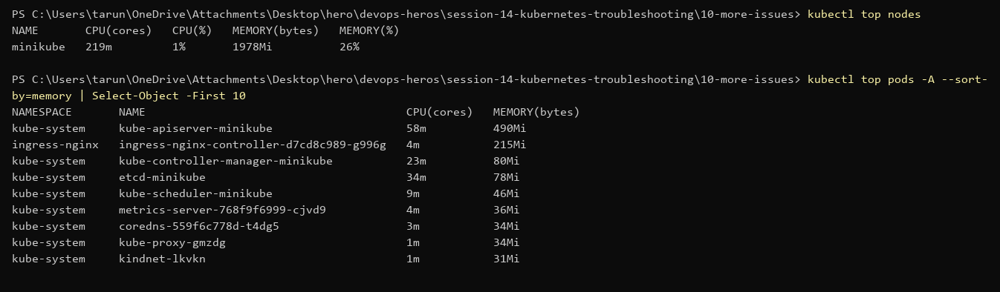

---

## Issue 1 — Pod stuck in `ContainerCreating`

Manifest: [`container-creating-broken.yaml`](./container-creating-broken.yaml)

**1. Identify** — pod never leaves `ContainerCreating`.

```powershell
kubectl apply -f container-creating-broken.yaml
kubectl get pod stuck-creating
```
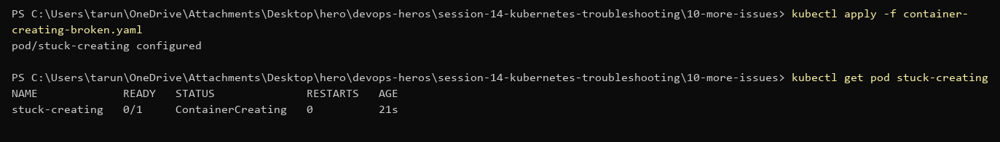

**2. Investigate** — no container yet, so `logs` has nothing. The Events say why:

```powershell
kubectl describe pod stuck-creating
kubectl get configmap site-content
```
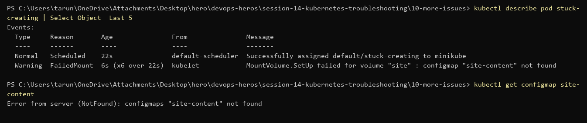

**3. Root cause** — `FailedMount: configmap "site-content" not found`. The pod mounts a ConfigMap volume that was never created, so kubelet can't set up the volume and won't start the container.

**4. Fix** — create the ConfigMap ([`site-content-configmap.yaml`](./site-content-configmap.yaml)). No need to recreate the pod; kubelet retries the mount.

**5. Verify** — pod goes `Running` and serves the ConfigMap's `index.html`.

```powershell
kubectl apply -f site-content-configmap.yaml
kubectl get pod stuck-creating
kubectl exec stuck-creating -- curl -s localhost
```
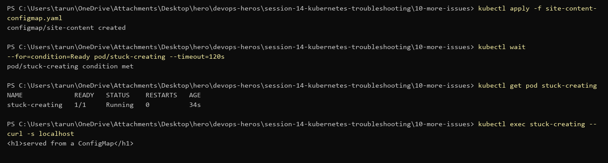

---

## Issue 2 — Configuration issue (`CreateContainerConfigError`)

Manifest: [`config-issue-broken.yaml`](./config-issue-broken.yaml)

**1. Identify**

```powershell
kubectl apply -f config-issue-broken.yaml
kubectl get pod bad-config
```
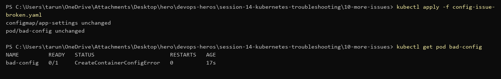

**2. Investigate** — check the events, then what's actually in the ConfigMap.

```powershell
kubectl describe pod bad-config
kubectl get configmap app-settings -o jsonpath='{.data}'
```
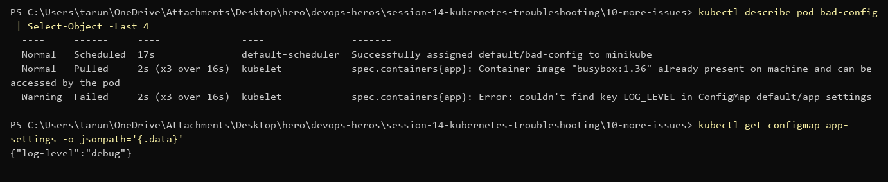

**3. Root cause** — `couldn't find key LOG_LEVEL in ConfigMap`. The ConfigMap key is `log-level`, the pod asks for `LOG_LEVEL`. Keys are case-sensitive and must match exactly.

**4. Fix** — point `configMapKeyRef.key` at `log-level` ([`config-issue-fixed.yaml`](./config-issue-fixed.yaml)). Env vars can't be changed on a running pod, so delete and re-apply.

**5. Verify**

```powershell
kubectl delete pod bad-config
kubectl apply -f config-issue-fixed.yaml
kubectl logs bad-config
```
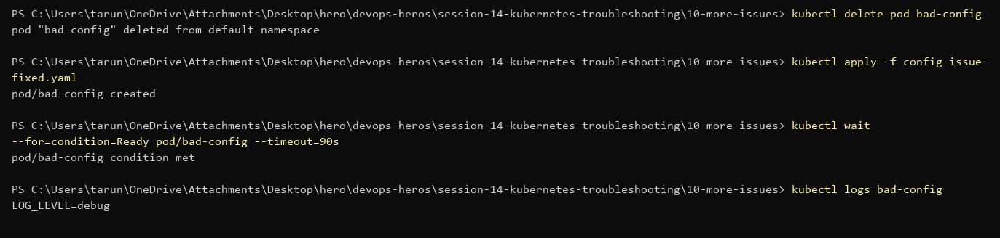

---

## Issue 3 — Pod networking: reachable inside the pod, not from outside

Manifest: [`networking-broken.yaml`](./networking-broken.yaml)

**1. Identify** — pod is `Running 1/1`, but another pod gets `Connection refused` on the pod IP.

```powershell
kubectl get pod net-app -o wide
kubectl run net-client --rm -i --restart=Never --image=busybox:1.36 -- wget -T 3 -qO- http://<pod-ip>:8000
```
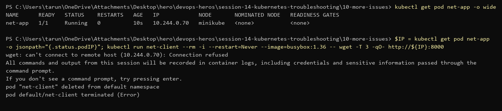

**2. Investigate** — from *inside* the pod it works. `netstat` shows what it's listening on.

```powershell
kubectl exec net-app -- wget -qO- http://127.0.0.1:8000
kubectl exec net-app -- netstat -tln
kubectl get pod net-app -o jsonpath='{.spec.containers[0].command}'
```
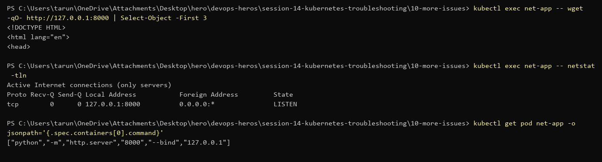

**3. Root cause** — the app binds to `127.0.0.1:8000`. Loopback is only reachable from inside the pod's own network namespace; traffic from other pods arrives on the pod IP (`eth0`), where nothing is listening. Not a CNI or Service problem.

**4. Fix** — bind to `0.0.0.0` ([`networking-fixed.yaml`](./networking-fixed.yaml)).

**5. Verify** — now listening on `0.0.0.0:8000`, and the other pod gets the page.

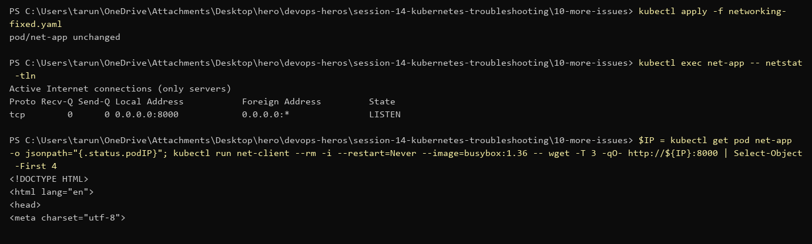

---

## 6-step summary for every issue in Session 14

| Issue | Identify | Investigate | Root cause | Fix | Verify | Screenshots |
|---|---|---|---|---|---|---|
| CrashLoopBackOff (lab 06) | `get pod` → CrashLoopBackOff, restarts climbing | `describe` (Exit Code 1), `logs`, `logs --previous` | container command prints an error and `exit 1` | command that keeps running (`fixed-pod.yaml`) | pod `Running`, restarts stop | 06-* |
| ImagePullBackOff / ErrImagePull (lab 07, mini-project) | status flips ErrImagePull ↔ ImagePullBackOff | `describe` Events: `...: not found` | image tag doesn't exist on Docker Hub | real tag `nginx:1.27` | pod `Running` | 07-*, mp-05, mp-06 |
| Pending (lab 08) | pod `Pending`, no node | `describe` → FailedScheduling; `get nodes --show-labels` | `nodeSelector` asks for a hostname no node has | remove the nodeSelector | pod scheduled + `Running` | 08-* |
| ContainerCreating | stuck ContainerCreating | `describe` → FailedMount | ConfigMap volume missing | create the ConfigMap | `Running`, serves content | 10-04 → 10-06 |
| Configuration issue | CreateContainerConfigError | `describe` + ConfigMap data | wrong key name | fix `configMapKeyRef.key` | `LOG_LEVEL=debug` in logs | 10-07 → 10-09 |
| Service connectivity (lab 09, mini-project) | Service has no endpoints | `describe svc` vs `get pods --show-labels` | selector doesn't match pod labels | correct selector | endpoints listed | 09-09 → 09-13, mp-07, mp-08 |
| DNS (lab 09) | lookup by service name | `nslookup`, `/etc/resolv.conf`, CoreDNS pods + logs | (no fault) checked CoreDNS is healthy and the name resolves | — | `nslookup` + `wget` by name work | 09-06 → 09-16 |
| Pod networking | Connection refused from other pods | exec inside, `netstat -tln` | app bound to 127.0.0.1 | bind 0.0.0.0 | other pod gets the page | 10-10 → 10-12 |
