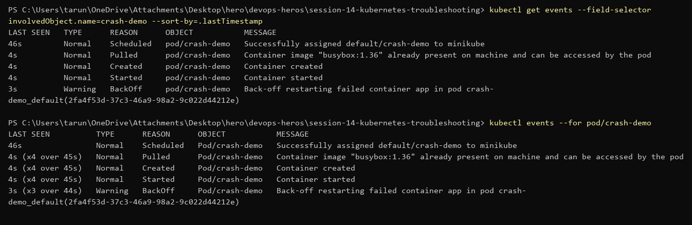
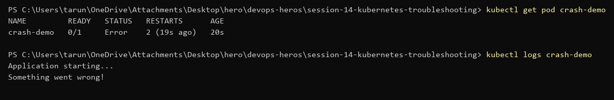

# Events vs Logs

Same broken pod (`06-crashloopbackoff/broken-pod.yaml`), looked at two ways.

## What is a Kubernetes event?

A record Kubernetes itself writes about an object: scheduled, image pulled, container started, probe failed, back-off. It tells you **what the cluster did**. Events expire (about 1 hour by default).

```powershell
kubectl get events --field-selector involvedObject.name=crash-demo --sort-by=.lastTimestamp
kubectl events --for pod/crash-demo
```


Events show the container is restarting (`BackOff`), but not *why* the app exits.

## What are Kubernetes logs?

The stdout/stderr of the container — what **the application** printed.

```powershell
kubectl get pod crash-demo
kubectl logs crash-demo
```


Logs show the app's own message: `Something went wrong!` then exit.

## Difference

| | Events | Logs |
|---|---|---|
| Written by | Kubernetes (scheduler, kubelet) | the app in the container |
| About | the object's lifecycle | what the app did |
| Good for | Pending, ImagePullBackOff, probe failures, OOMKilled | crashes, app errors, stack traces |
| Lifetime | ~1 hour | until the container is replaced (`--previous` = last one) |

## Commands

Events:
```powershell
kubectl get events                                  # namespace events
kubectl get events --sort-by=.lastTimestamp         # oldest → newest
kubectl events --for pod/<name>                     # one object
kubectl get events -w                               # watch live
kubectl describe pod <name>                         # Events section at the bottom
```

Logs:
```powershell
kubectl logs <pod>                 # current container
kubectl logs <pod> --previous      # container that crashed before this one
kubectl logs <pod> -f              # follow
kubectl logs <pod> -c <container>  # multi-container pod
kubectl logs deploy/<name>         # one pod of a deployment
```

Rule of thumb: pod never started → events. Pod started then died → logs.
