# Session 15 — Helm (Submission)

Cluster: Minikube. Helm v4.3.0.

## Helm basics

**Version + repo**
```powershell
helm version
helm repo add bitnami https://charts.bitnami.com/bitnami
helm repo update
helm search repo bitnami/nginx
```
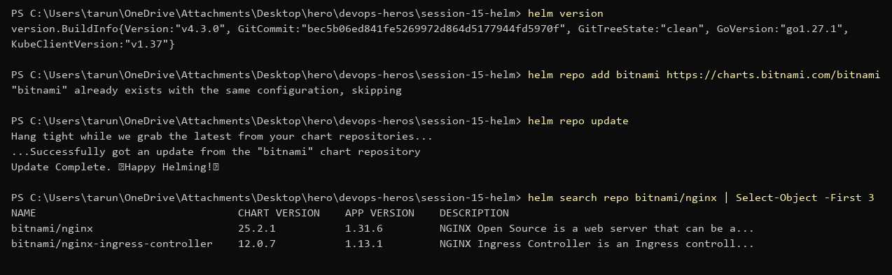

**`helm create myapp` — chart structure** (`02-helm-charts/myapp`)
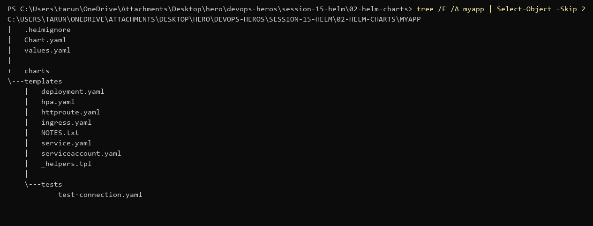

**Lint + `upgrade --install` + `kubectl get all`**
```powershell
helm lint myapp
helm upgrade --install myapp ./myapp
helm list
kubectl get all -l app.kubernetes.io/instance=myapp
```
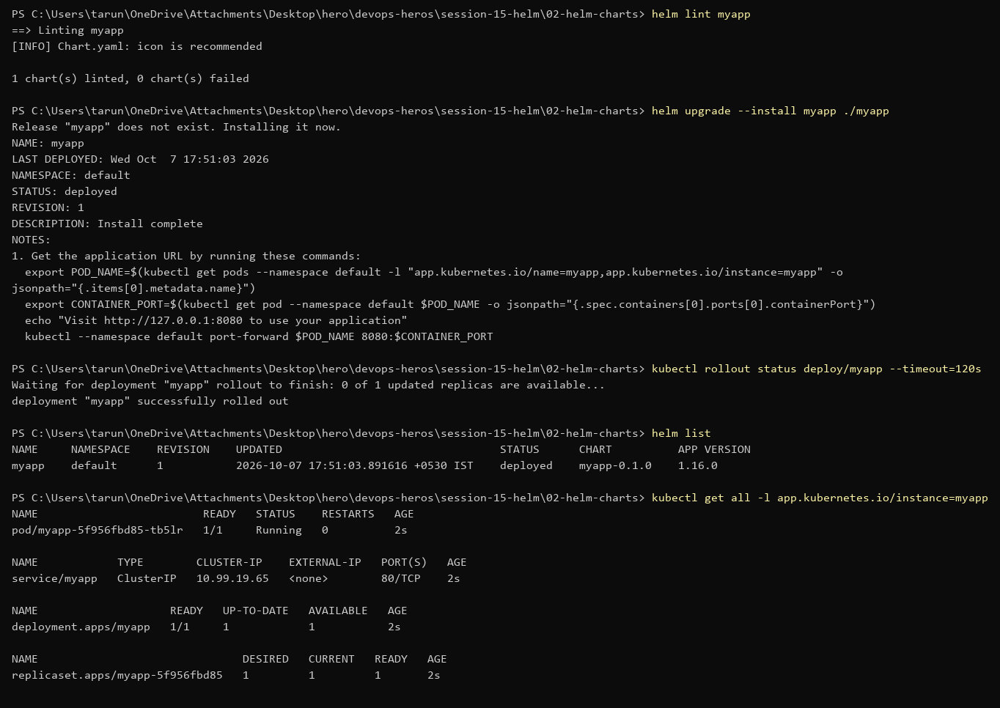

**`--set` override** — replicas 1 → 3 without editing values.yaml
```powershell
helm upgrade myapp ./myapp --set replicaCount=3
helm get values myapp
helm status myapp
```
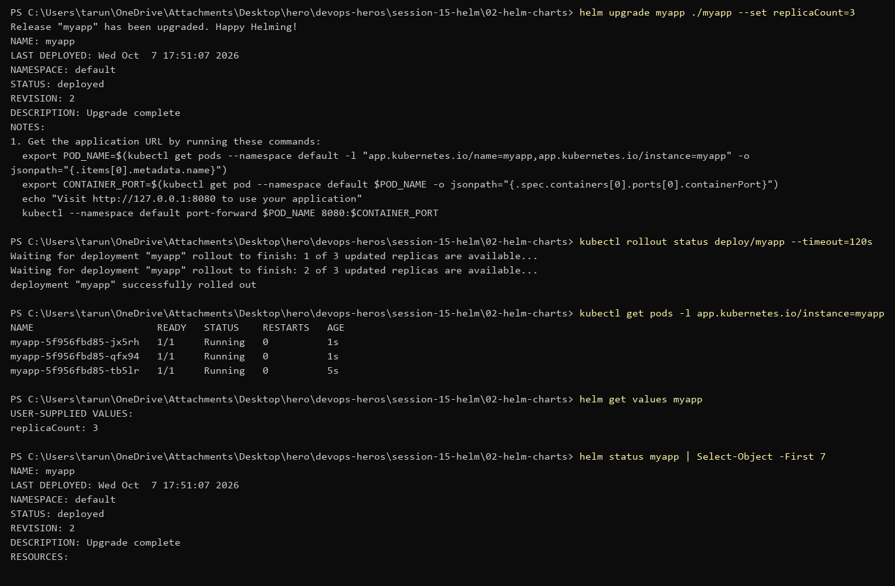

---

## Mini Project — Notes app chart (`mini-project/notes-chart`)

**Lint + render**
```powershell
helm lint notes-chart
helm template notes-dev notes-chart
```
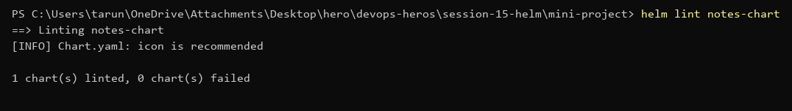
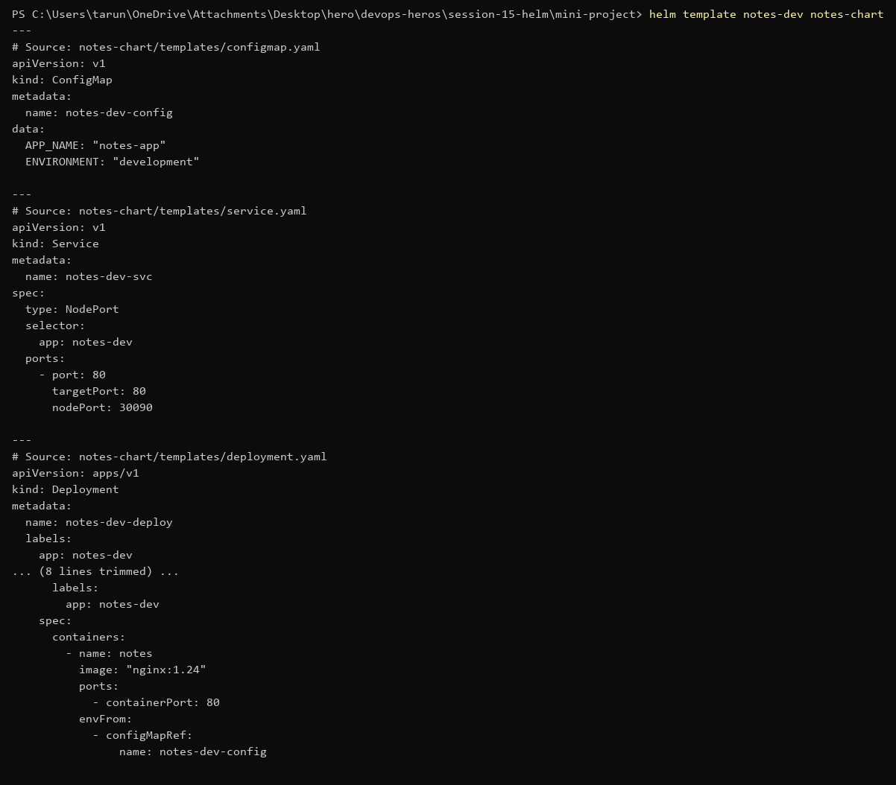

**Install (dev values)** — 1 pod, NodePort service, ConfigMap
```powershell
helm install notes-dev notes-chart
```
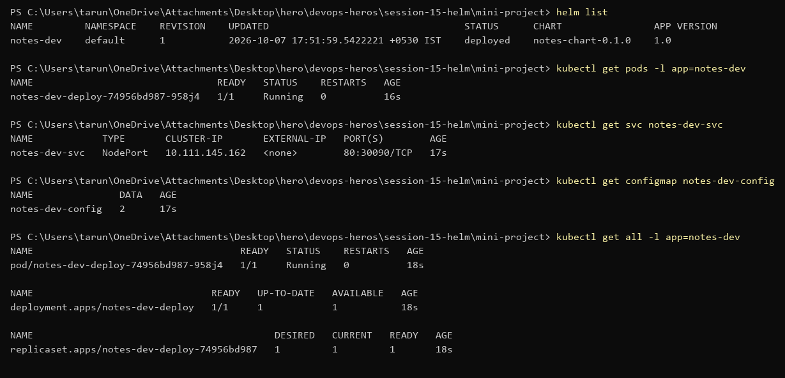

**Upgrade to prod values** — 3 replicas, revision 2
```powershell
helm upgrade notes-dev notes-chart -f notes-chart/values-prod.yaml
```
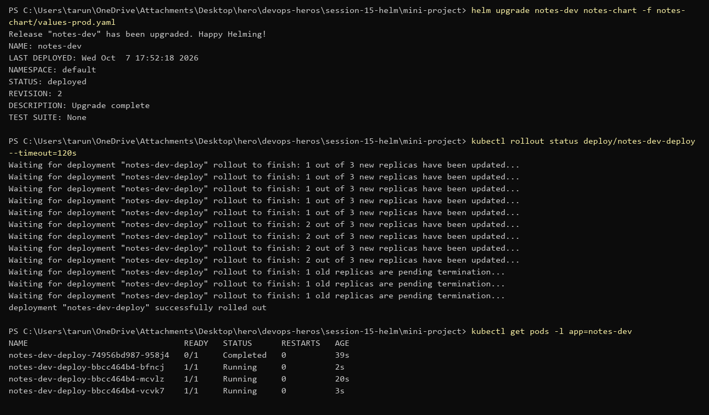

**History**
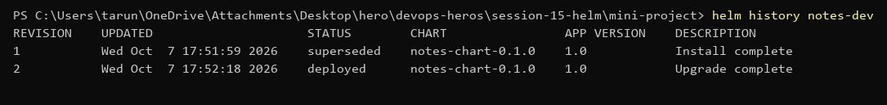

**Bad upgrade** — image tag that doesn't exist → new pod stuck in `ImagePullBackOff`. Old pods keep serving because of the rolling update.
```powershell
helm upgrade notes-dev notes-chart -f notes-chart/values-prod.yaml --set image.tag=broken-tag-does-not-exist
```
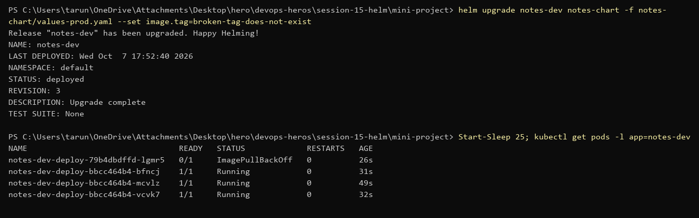

**Rollback to revision 2** — rollback creates a new revision (4) with revision 2's config.
```powershell
helm rollback notes-dev 2
helm history notes-dev
```
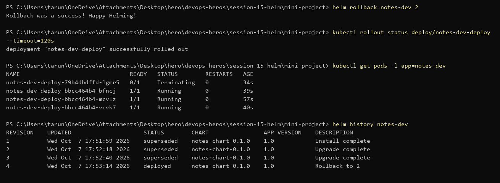

**Uninstall**
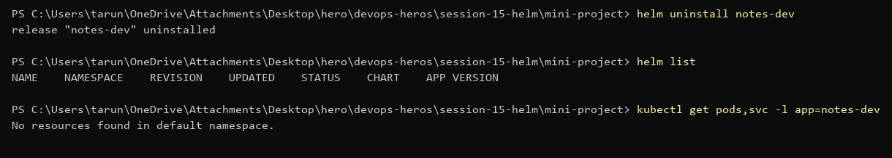
