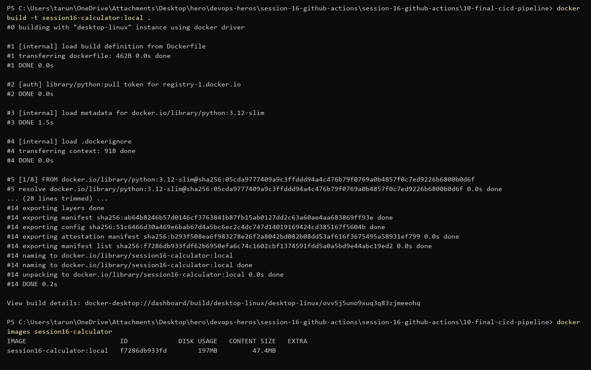
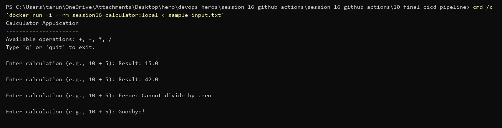
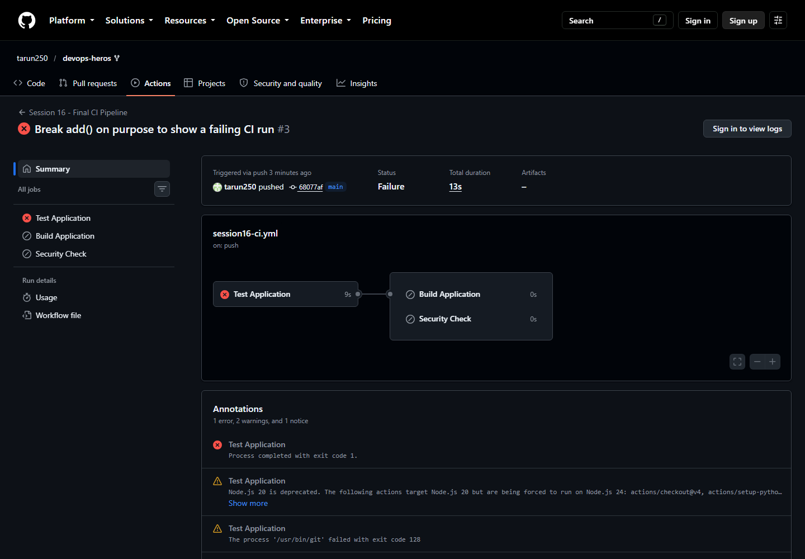
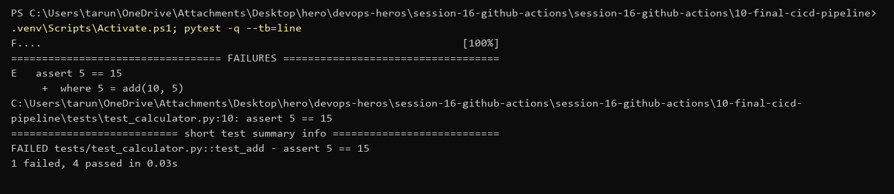
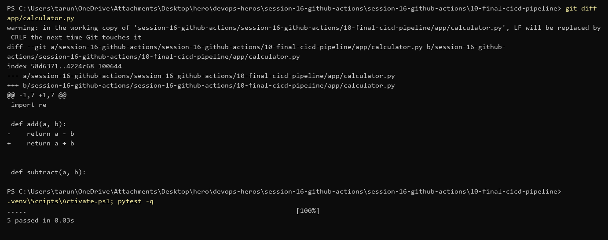
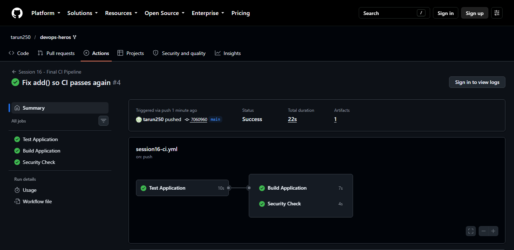
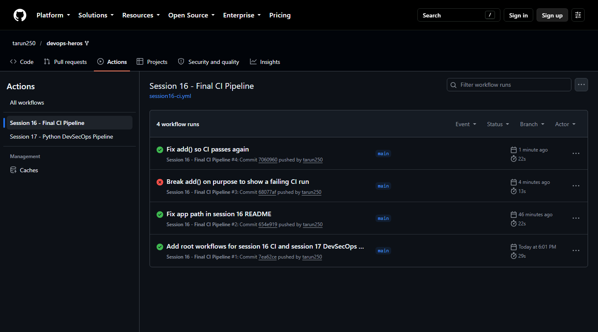

# Session 16 — CI/CD & GitHub Actions (Submission)

Pipeline: [`.github/workflows/session16-ci.yml`](../.github/workflows/session16-ci.yml)
App: `session-16-github-actions/session-16-github-actions/10-final-cicd-pipeline` (calculator + pytest)

GitHub only runs workflows from the repo root `.github/workflows/`, so the workflow lives there and uses `working-directory` to point at the session folder.

## Concepts

| Term | Meaning | In my workflow |
|---|---|---|
| CI | every push is built + tested automatically | `test` job on every push |
| CD | tested build is shipped automatically (delivery = ready to release, deployment = released) | `build` uploads the artifact; session 17 deploys to Kubernetes |
| Workflow | YAML file in `.github/workflows/` | `session16-ci.yml` |
| Trigger (`on:`) | what starts it | `push` / `pull_request` to `main`, `paths` filter, `workflow_dispatch` |
| Branch filter | only run for some branches | `branches: [main]` |
| Job | group of steps on one runner; jobs run in parallel unless `needs:` | `test` → `build` + `security-check` in parallel |
| Step | one command (`run:`) or action (`uses:`) | checkout, setup-python, pytest |
| Runner | the machine that runs a job | GitHub-hosted `ubuntu-latest` (self-hosted is possible) |
| Secret | encrypted value, injected as `${{ secrets.NAME }}`, masked as `***` in logs | `secrets.GITHUB_TOKEN` logs in to GHCR in both CD jobs |
| Artifact | file kept after the run | `calculator-build` (the `build/` folder) |

## Pipeline

| Job | Needs | What it does |
|---|---|---|
| Test Application | – | setup Python 3.12, `pip install`, `pytest -v` |
| Build Application | test | `build.sh`, upload `build/` as artifact `calculator-build` |
| Security Check | test | fails if `.env`, `*.pem`, `*.key` files are committed |
| **CD** – Build & Push Image | build, security-check | `docker build` (tests run inside the build), push `ghcr.io/tarun250/session16-calculator:<sha>`; logs in with the `GITHUB_TOKEN` secret |
| **CD** – Deploy & Smoke Test | docker-push | `environment: dev`; pulls the released image from GHCR, runs it with `sample-input.txt`, checks the results |

Triggers: push to `main` (only when session 16 files or the workflow change), pull requests, `workflow_dispatch` (manual run button).

## Local run first

```powershell
pytest -v
```


```powershell
bash build.sh
```


## Dockerfile + CD

[`Dockerfile`](./session-16-github-actions/10-final-cicd-pipeline/Dockerfile): `python:3.12-slim`, runs `pytest` during the build (a failing test means no image), non-root user, starts the calculator.

```powershell
docker build -t session16-calculator:local .
```


The app is an interactive CLI, so the smoke test pipes input in ([`sample-input.txt`](./session-16-github-actions/10-final-cicd-pipeline/sample-input.txt)):

```powershell
cmd /c 'docker run -i --rm session16-calculator:local < sample-input.txt'
```


CI = test + build + security check. CD = build the image, push it to GHCR tagged with the commit SHA, then a deploy job (GitHub environment `dev`) pulls that exact image from the registry and smoke-tests it.

## GitHub Actions run

Run: https://github.com/tarun250/devops-heros/actions/runs/37621643045 — all 3 jobs green, 1 artifact.


## Failed run → fix → re-run

Broke `add()` on purpose (`a + b` → `a - b`) and pushed. `Test Application` failed, so `Build` and `Security Check` were skipped (they `need` test). Nothing broken got built.



Reproduced it locally to find the cause:

```powershell
pytest -q --tb=line
```


Fixed the code, tests pass locally:



Pushed the fix, pipeline green again:



Run history — red then green:



A failed job can also be re-run from the run page (**Re-run failed jobs**) when the failure was flaky, not a code bug.
