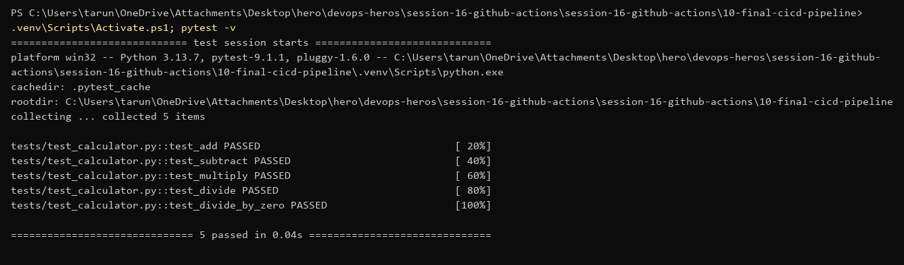
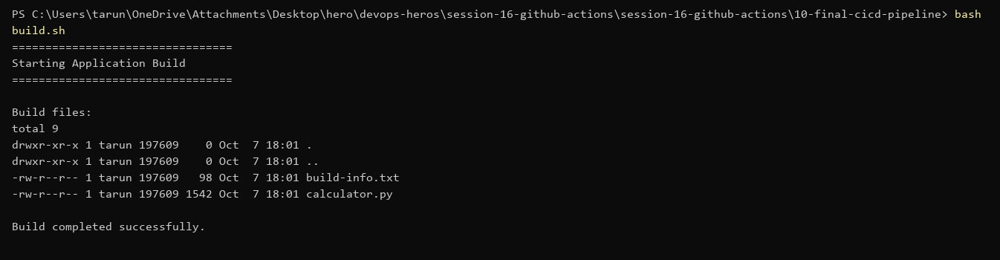
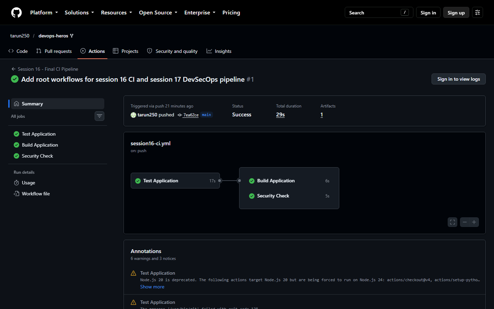

# Session 16 — CI/CD & GitHub Actions (Submission)

Pipeline: [`.github/workflows/session16-ci.yml`](../.github/workflows/session16-ci.yml)
App: `session-16-github-actions/session-16-github-actions/10-final-cicd-pipeline` (calculator + pytest)

GitHub only runs workflows from the repo root `.github/workflows/`, so the workflow lives there and uses `working-directory` to point at the session folder.

## Pipeline

| Job | Needs | What it does |
|---|---|---|
| Test Application | – | setup Python 3.12, `pip install`, `pytest -v` |
| Build Application | test | `build.sh`, upload `build/` as artifact `calculator-build` |
| Security Check | test | fails if `.env`, `*.pem`, `*.key` files are committed |

Triggers: push to `main` (only when session 16 files or the workflow change), pull requests, `workflow_dispatch` (manual run button).

## Local run first

```powershell
pytest -v
```


```powershell
bash build.sh
```


## GitHub Actions run

Run: https://github.com/tarun250/devops-heros/actions/runs/37621643045 — all 3 jobs green, 1 artifact.


