# Session 17 — Complete CI/CD & DevSecOps (Submission)

App: `demo/` (Flask "hey-cicd" dashboard). Pipeline: [`.github/workflows/session17-devsecops.yml`](../.github/workflows/session17-devsecops.yml)

## Pipeline

```text
Unit Tests ─┐
SAST ───────┤
SCA ────────┼─> Build + Trivy gate + Push (GHCR) ─> Deploy to kind + smoke test
Secrets ────┘
```

| Stage | Tool | Gate |
|---|---|---|
| Tests | pytest + coverage | any failing test |
| SAST | CodeQL + Bandit | Bandit HIGH |
| SCA | pip-audit | any known CVE in `requirements.txt` |
| Secret scan | Gitleaks | any leak in `demo/` history |
| Image scan | Trivy | HIGH/CRITICAL with a fix available |
| Registry | GHCR `ghcr.io/tarun250/hey-cicd:<sha>` | only on push to main |
| Deploy | kind cluster, `kubectl apply`, rollout status, curl `/api/status` | rollout/curl fail |

Only `GITHUB_TOKEN` is used (GHCR push + image pull secret) — no hard-coded credentials.

## Running each stage locally

**Tests** — 8 passed
```powershell
pytest --cov=app --cov-report=term-missing
```
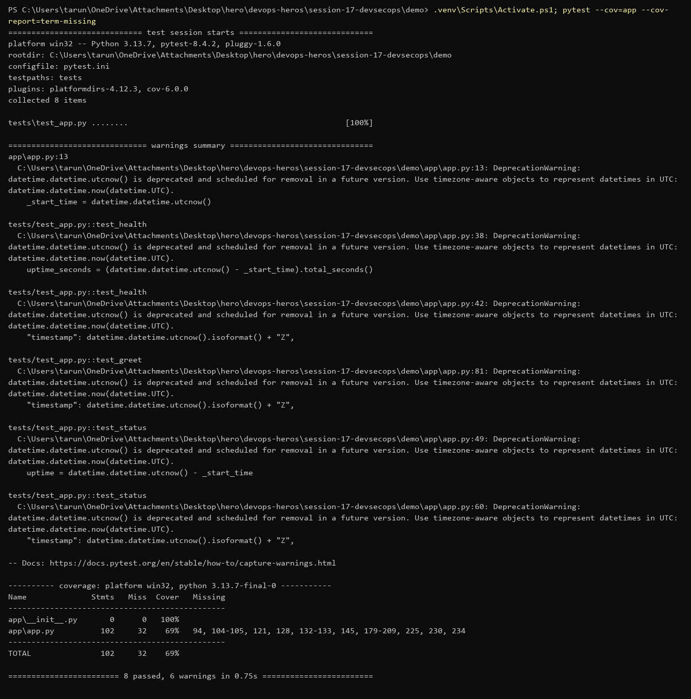

**SAST (Bandit)** — found `debug=True` on the Flask app (HIGH: Werkzeug debugger allows remote code execution).
```powershell
bandit -r app -ll
```
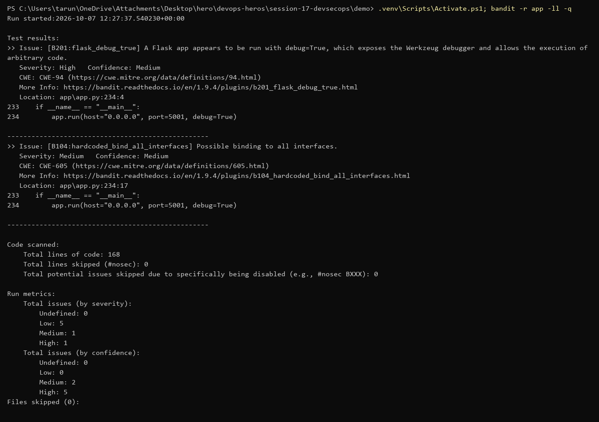

Fixed in `app/app.py`: debug only when `FLASK_DEBUG=1`. HIGH is gone. The remaining MEDIUM (bind `0.0.0.0`) is accepted — the container must listen on all interfaces.

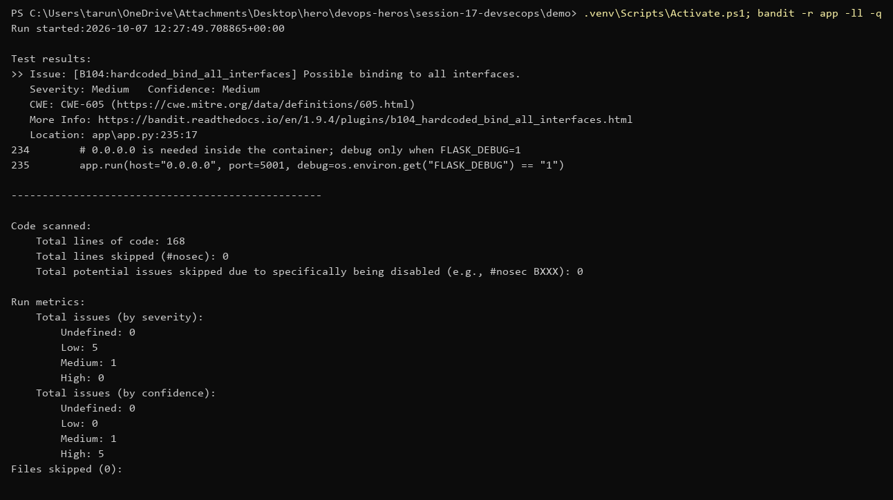

**SCA**
```powershell
pip-audit -r requirements.txt
```
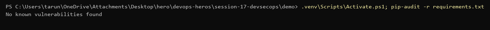

**Secret scanning**
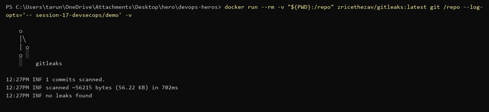

**Docker build**
```powershell
docker build -t tarun250/hey-cicd:v1 .
```
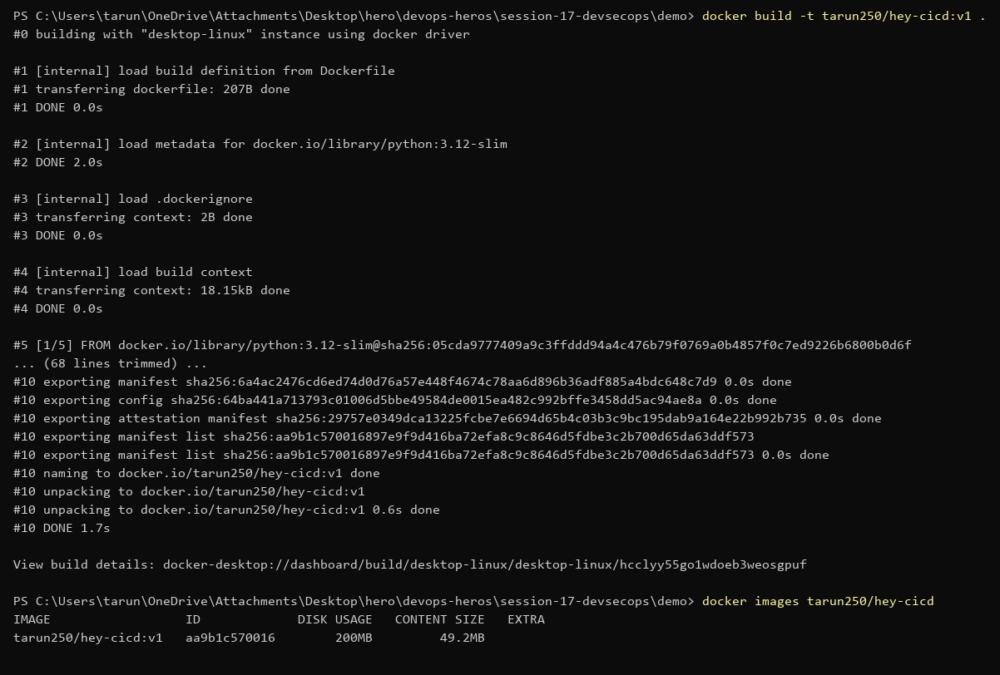

**Trivy image scan** — 0 HIGH/CRITICAL in the Debian base and all Python packages.
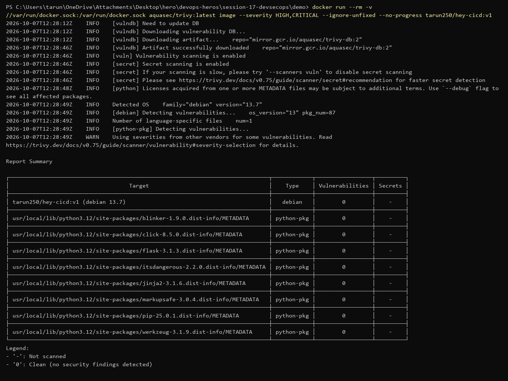

**Push to Docker Hub**
```powershell
docker push tarun250/hey-cicd:v1
```
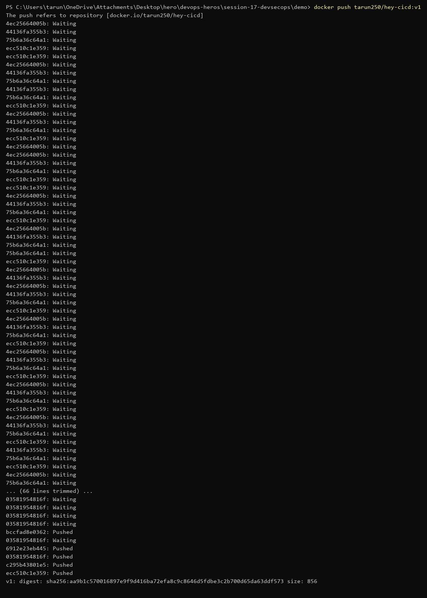

**Deploy to Minikube** — `k8s/deployment.yaml` with the image swapped to `tarun250/hey-cicd:v1`, NodePort service.
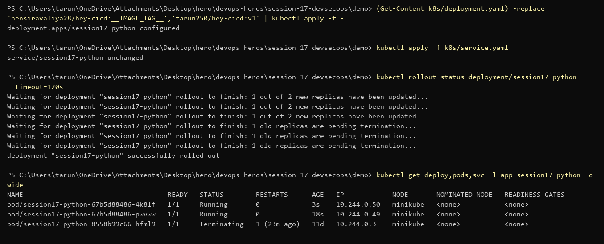
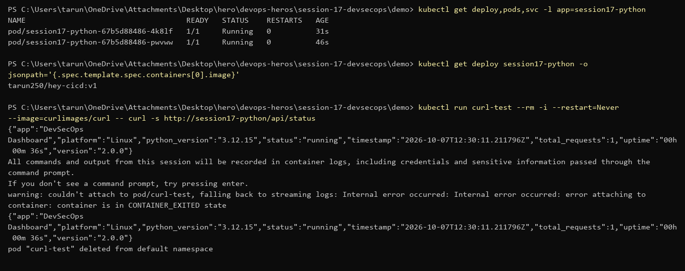

## GitHub Actions run

Run: https://github.com/tarun250/devops-heros/actions/runs/37621643048 — all 6 jobs green.

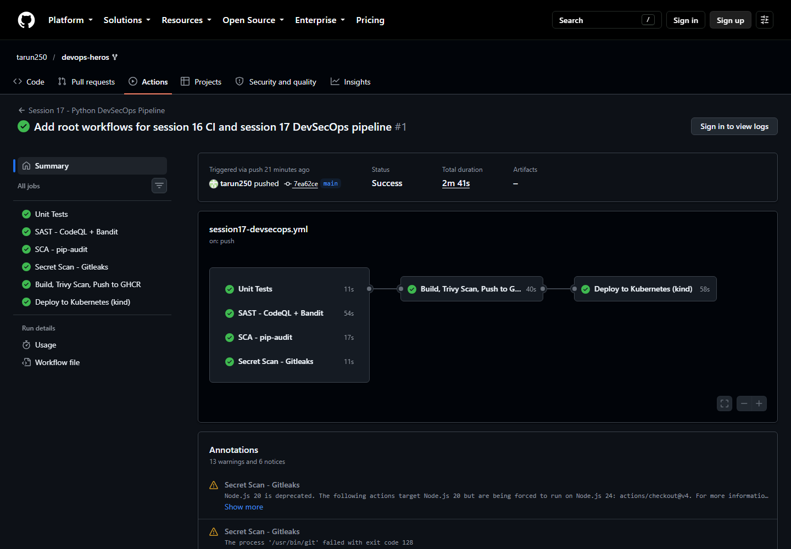
