# Session 10 — Kubernetes Core Objects & Deployment Strategies

**Repo:** devops-heros / `session10-k8s-core-objects`
**Cluster:** Minikube v1.39.0 (docker driver), Kubernetes v1.37.0, containerd 2.3.4

---

## Task 1 — Cluster health check

Confirm the control plane, CoreDNS and the node are up before deploying anything.

```bash
kubectl cluster-info
kubectl get nodes -o wide
kubectl version --client
```

**Output**

```
Kubernetes control plane is running at https://127.0.0.1:50906
CoreDNS is running at https://127.0.0.1:50906/api/v1/namespaces/kube-system/services/kube-dns:dns/proxy

NAME       STATUS   ROLES           AGE   VERSION   INTERNAL-IP    CONTAINER-RUNTIME
minikube   Ready    control-plane   25m   v1.37.0   192.168.49.2   containerd://2.3.4
```

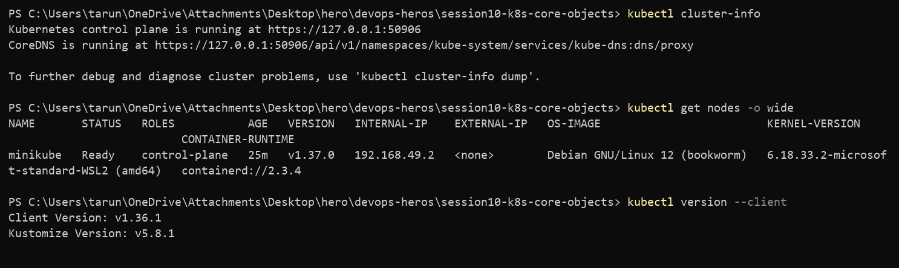

---

## Task 2 — Deploy a single Pod (`pod.yml`)

A bare Pod with the 4 mandatory fields: `apiVersion`, `kind`, `metadata`, `spec`.

```bash
kubectl apply -f pod.yml
kubectl get pods -o wide
kubectl logs nginx-pod
kubectl delete -f pod.yml
```

**Output**

```
pod/nginx-pod created

NAME        READY   STATUS    RESTARTS   AGE   IP           NODE
nginx-pod   1/1     Running   0          2s    10.244.0.6   minikube
```

Pod got IP `10.244.0.6` from the CNI, scheduled on `minikube`.

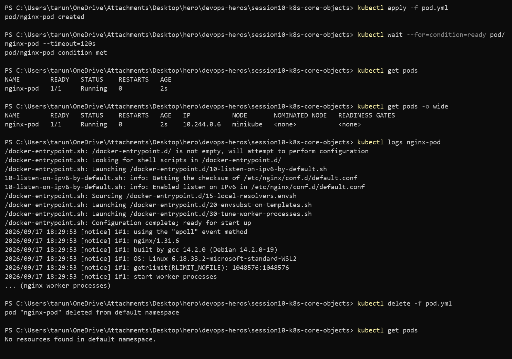

---

## Task 3 — ErrImagePull → ImagePullBackOff

Point a pod at an image that does not exist and watch the kubelet back off.

```bash
kubectl apply -f pod-lifecycle/06-imagepullbackoff.yaml
kubectl get pod lifecycle-image-error
kubectl describe pod lifecycle-image-error | grep -A 10 Events:
```

**Output**

```
NAME                    READY   STATUS             RESTARTS   AGE
lifecycle-image-error   0/1     ImagePullBackOff   0          20s

Normal   Scheduled  Successfully assigned default/lifecycle-image-error to minikube
Warning  Failed     Failed to pull image "jakwehrgkaejw:kahsdfgkhj": pull access denied,
                    repository does not exist or may require authorization
Warning  Failed     Error: ErrImagePull
Normal   BackOff    Back-off pulling image "jakwehrgkaejw:kahsdfgkhj"
```

**Why the object exists but the container does not:** the API server only validates the YAML and writes it to etcd — that part succeeds. Pulling the image happens later, on the node, so the failure shows up as a container state instead of an apply error. `ErrImagePull` is the first failure, `ImagePullBackOff` is the retry loop with a growing delay.

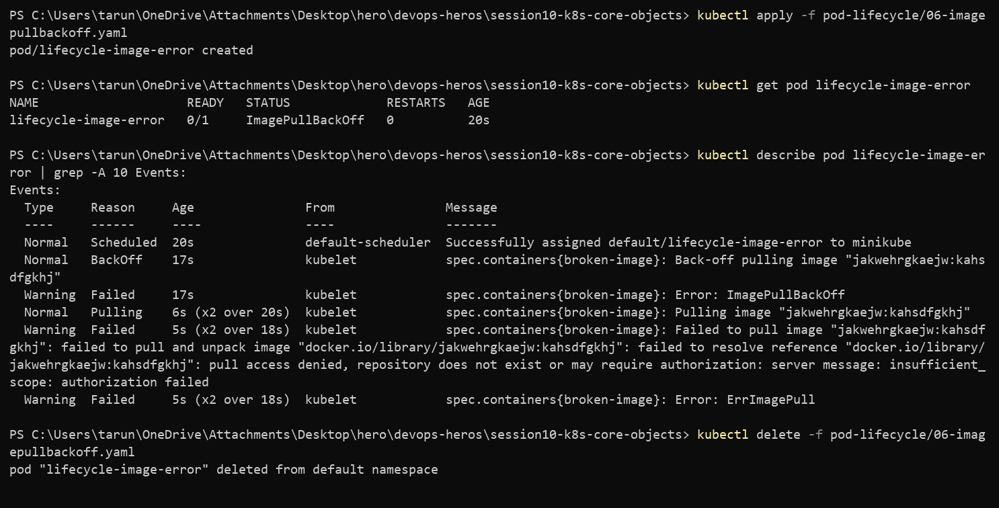

---

## Task 4 — Catching all pod phases (`hello.yml`)

`restartPolicy: Never` plus a command that exits. Watch in one terminal, apply in another.

```bash
# terminal 1
kubectl get pods -w
# terminal 2
kubectl apply -f hello.yml
```

**Output**

```
NAME        READY   STATUS              RESTARTS   AGE
hello-pod   0/1     Pending             0          0s
hello-pod   0/1     ContainerCreating   0          0s
hello-pod   1/1     Running             0          2s
hello-pod   0/1     Completed           0          2s

$ kubectl logs hello-pod
Hello Kubernetes

$ kubectl get pod hello-pod -o jsonpath='{.status.phase}'
Succeeded
```

The STATUS column says `Completed`, the actual phase is `Succeeded`.

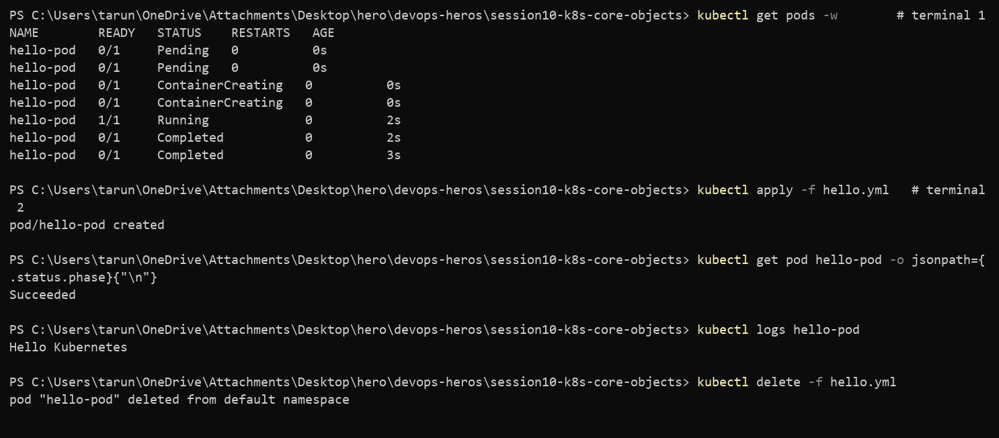

---

## Task 5 — Pod lifecycle & probes lab (`pod-lifecycle/`)

All 12 manifests, one by one.

| # | File | Result |
| --- | --- | --- |
| 01 | `01-running.yaml` | `1/1 Running` |
| 02 | `02-pending.yaml` | `Pending` — FailedScheduling |
| 03 | `03-succeeded.yaml` | `Completed` (exit 0) |
| 04 | `04-failed.yaml` | `Error` (exit 1) |
| 05 | `05-crashloopbackoff.yaml` | `CrashLoopBackOff`, restarts climbing |
| 06 | `06-imagepullbackoff.yaml` | `ImagePullBackOff` (Task 3) |
| 07 | `07-readiness.yaml` | `Running` before `Ready` |
| 08 | `08-liveness.yaml` | restarted by the probe |
| 09 | `09-startup.yaml` | `0/1` for 60s, then `1/1` |
| 10 | `10-init-container.yaml` | `Init:0/1` → `Running` |
| 11 | `11-multi-container.yaml` | `2/2 Running` |
| 12 | `12-termination.yaml` | 10s graceful shutdown |

### 5.1 Running / Pending / Succeeded / Failed

```bash
kubectl apply -f 02-pending.yaml
kubectl describe pod lifecycle-pending | grep -A 5 Events:
```

```
NAME                READY   STATUS    RESTARTS   AGE
lifecycle-pending   0/1     Pending   0          8s

Warning  FailedScheduling  0/1 nodes are available: 1 Insufficient memory.

NAME                  READY   STATUS      RESTARTS   AGE
lifecycle-succeeded   0/1     Completed   0          21s

NAME               READY   STATUS   RESTARTS   AGE
lifecycle-failed   0/1     Error    0          20s
      Reason:       Error
      Exit Code:    1
```

`Pending` means the scheduler cannot place it. Nothing is wrong with the image — the node just does not have the memory that was requested.

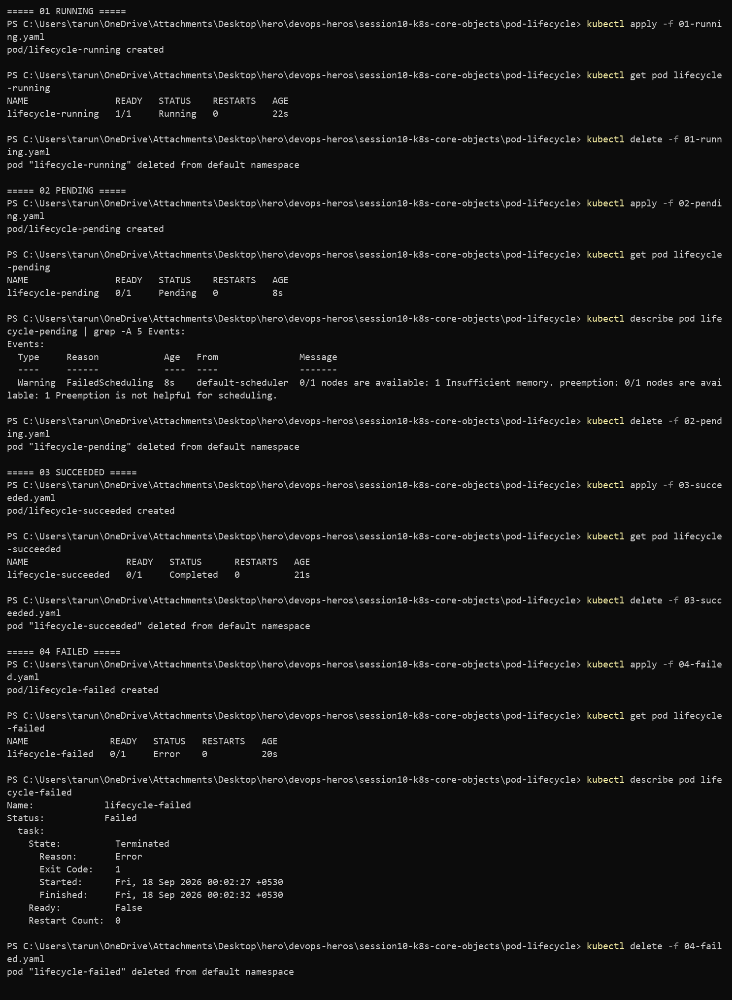

### 5.2 CrashLoopBackOff + readiness probe

```bash
kubectl apply -f 05-crashloopbackoff.yaml
kubectl get pod lifecycle-crashloop -w
```

```
lifecycle-crashloop   1/1     Running            0            1s
lifecycle-crashloop   0/1     Error              0            4s
lifecycle-crashloop   1/1     Running            1 (0s ago)   4s
lifecycle-crashloop   0/1     CrashLoopBackOff   1 (11s ago)  18s
lifecycle-crashloop   0/1     CrashLoopBackOff   2 (30s ago)  51s
lifecycle-crashloop   0/1     CrashLoopBackOff   3 (55s ago)  109s
```

The gap doubles each time — 0s → 11s → 30s → 55s. That is the exponential backoff, capped at 5 minutes.

Readiness probe — the container is `Running` at 0s but only `Ready` at 5s:

```
lifecycle-readiness   0/1     Running   0   0s
lifecycle-readiness   1/1     Running   0   5s
```

Until it reads `1/1`, a Service will not send traffic to it.

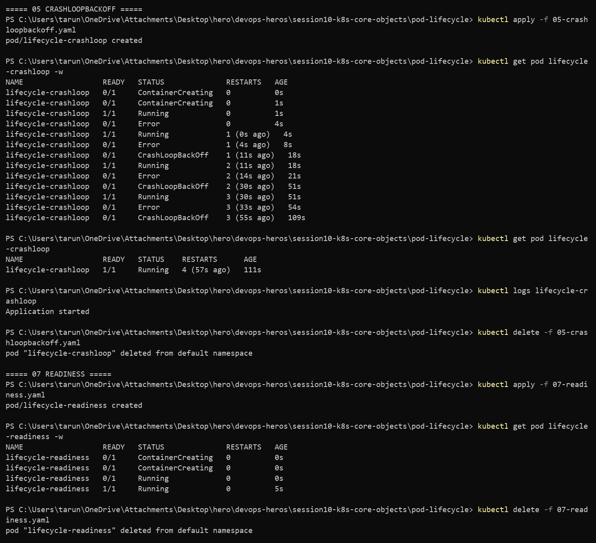

### 5.3 Liveness probe — self-healing restart

```bash
kubectl apply -f 08-liveness.yaml
kubectl get pod lifecycle-liveness -w
```

```
lifecycle-liveness   1/1     Running   0            1s
lifecycle-liveness   1/1     Running   1 (0s ago)   61s

Warning  Unhealthy  Liveness probe failed:
Normal   Killing    Container app failed liveness probe, will be restarted
```

RESTARTS went 0 → 1 with nobody touching it. Readiness pulls you out of the Service; liveness kills and restarts you.

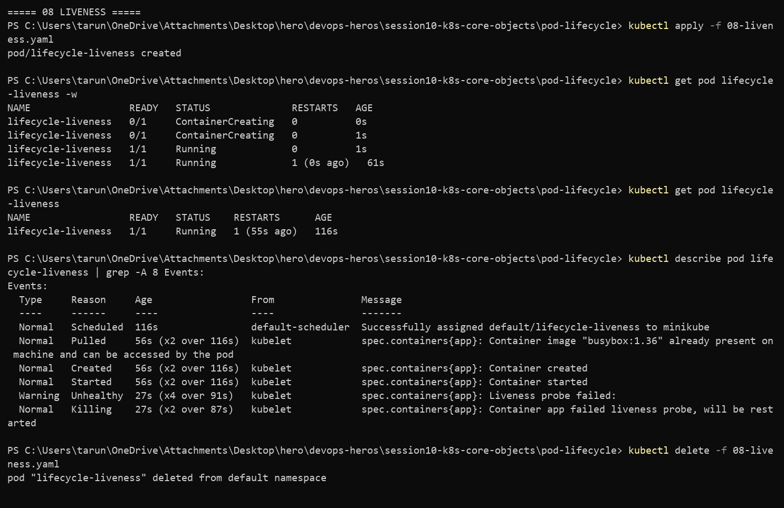

### 5.4 Startup probe

```
NAME                READY   STATUS    RESTARTS   AGE
lifecycle-startup   0/1     Running   0          20s
lifecycle-startup   1/1     Running   0          60s
```

Liveness stays disabled until the startup probe passes — that is how slow-booting apps avoid getting killed while they are still starting.

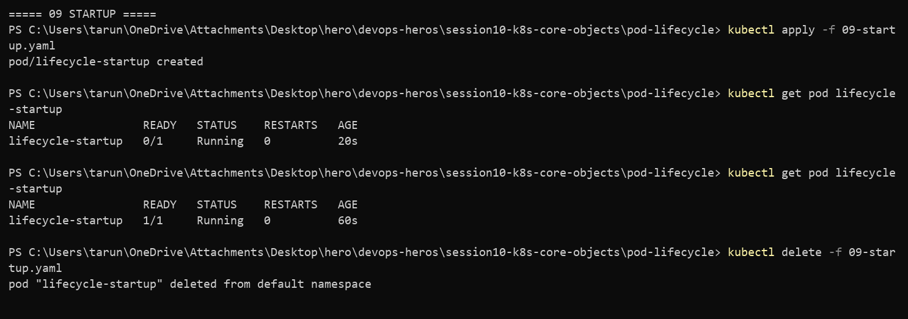

### 5.5 Init container, sidecar, graceful shutdown

```
NAME             READY   STATUS     RESTARTS   AGE
lifecycle-init   0/1     Init:0/1   0          5s
lifecycle-init   1/1     Running    0          30s

NAME                        READY   STATUS    RESTARTS   AGE
lifecycle-multi-container   2/2     Running   0          25s

$ kubectl logs lifecycle-multi-container -c sidecar
Sidecar is running
Sidecar is running

$ kubectl delete -f 12-termination.yaml
took 10s   # SIGTERM trap + terminationGracePeriodSeconds
```

`2/2` is the app container plus the sidecar, sharing one IP. The delete took 10s instead of being instant because the container traps SIGTERM and finishes its cleanup first.

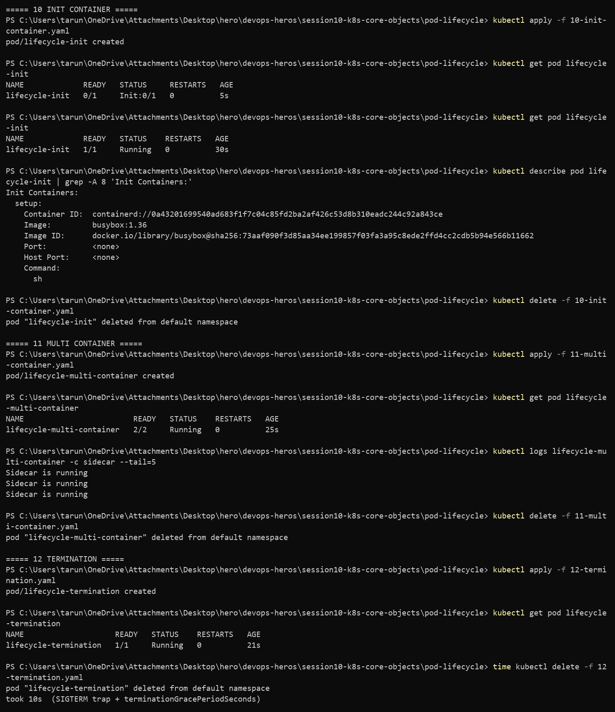

---

## Task 6 — ReplicaSet & StatefulSet

### Part A — ReplicaSet self-healing

```bash
kubectl apply -f replicaset.yml
kubectl delete pod nginx-rs-52hd2
kubectl get pods -l app=nginx
```

```
NAME             READY   STATUS              RESTARTS   AGE
nginx-rs-2p6vn   0/1     ContainerCreating   0          1s     <-- new pod, new name
nginx-rs-7zbkk   1/1     Running             0          27s
nginx-rs-qtj86   1/1     Running             0          27s
```

Deleted one pod and the ReplicaSet already had a replacement in `ContainerCreating` one second later. The desired count never dropped below 3.

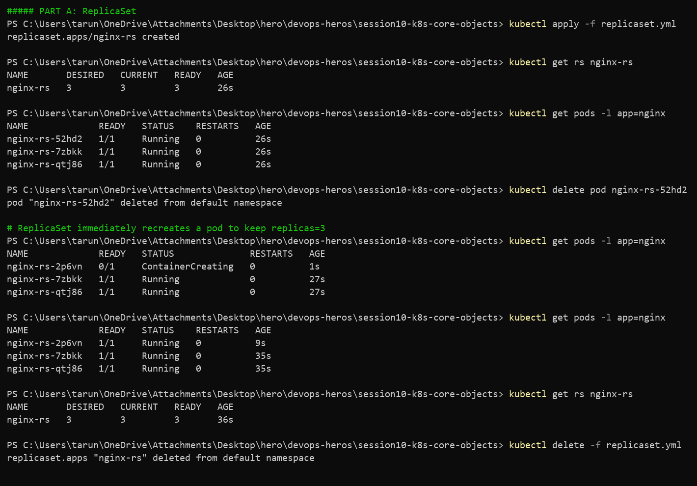

### Part B — StatefulSet

```bash
kubectl apply -f k8s-core-objects/statefulset.yml
kubectl get pods -l app=mysql
kubectl get pvc
```

```
NAME      READY   STATUS    RESTARTS   AGE
mysql-0   1/1     Running   0          2m
mysql-1   1/1     Running   0          83s
mysql-2   1/1     Running   0          82s

NAME                               STATUS   VOLUME                                     CAPACITY
mysql-persistent-storage-mysql-0   Bound    pvc-546645f0-8f46-4980-b3b9-a460cf86f151   5Gi
mysql-persistent-storage-mysql-1   Bound    pvc-7ed2fd20-c7c8-4257-8e5b-89a5dd191461   5Gi
mysql-persistent-storage-mysql-2   Bound    pvc-4e56352e-ada2-4cf2-b430-6ea4eabc4dce   5Gi
```

Names are ordinal (`mysql-0,1,2`), not random. The ages prove they started in order — `mysql-0` is ~40s older than `mysql-1`. Each ordinal got its own 5Gi PVC from `volumeClaimTemplates`.

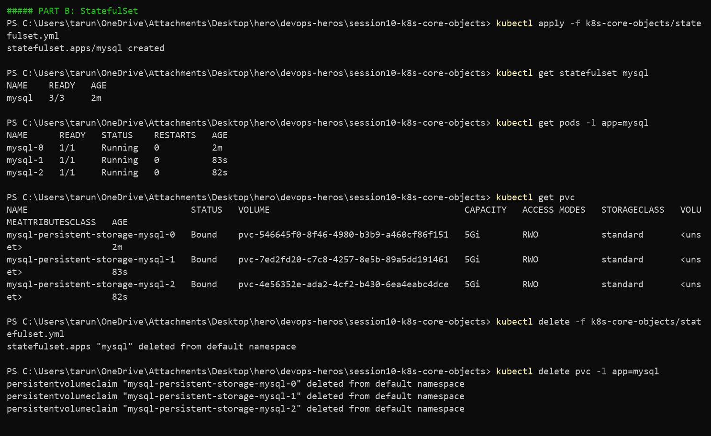

---

## Task 7 — DaemonSet

One agent pod per node, automatically.

```bash
kubectl apply -f k8s-core-objects/deamonset.yml
kubectl get ds node-exporter
kubectl get pods -l app=node-exporter -o wide
```

```
NAME            DESIRED   CURRENT   READY   UP-TO-DATE   AVAILABLE   AGE
node-exporter   1         1         1       1            1           45s

NAME                  READY   STATUS    RESTARTS   AGE   IP            NODE
node-exporter-8gcwx   1/1     Running   0          45s   10.244.0.59   minikube
```

DESIRED is 1 because this cluster has 1 node. Nobody set `replicas: 1` — the DaemonSet controller derived it from the node count. Add a node and a pod shows up there on its own.

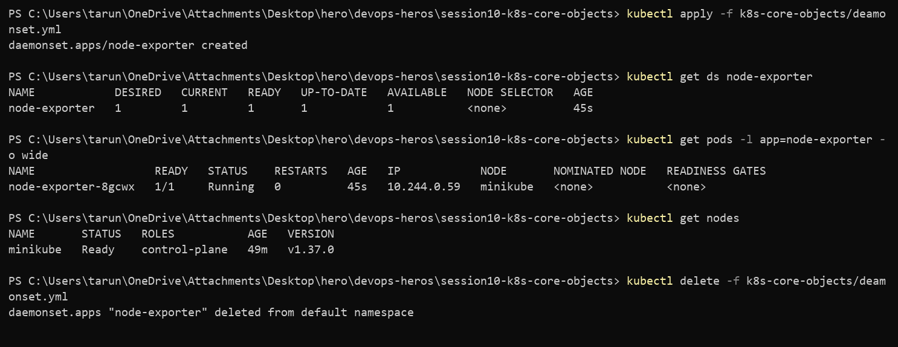

---

## Task 8 — Rolling update & rollback (`01-rolling-update/`)

`maxSurge: 1`, `maxUnavailable: 0` — never drop below 4 healthy pods.

```bash
kubectl apply -f 01-rolling-update/deployment-v1.yaml
kubectl apply -f 01-rolling-update/service.yaml
kubectl apply -f 01-rolling-update/deployment-v2.yaml
kubectl rollout status deployment/app-rolling
kubectl rollout history deployment/app-rolling
kubectl rollout undo deployment/app-rolling
```

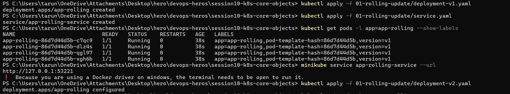
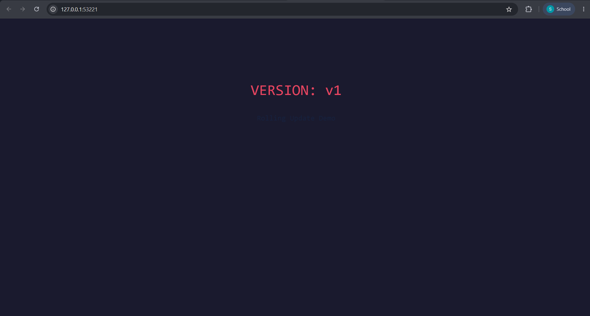
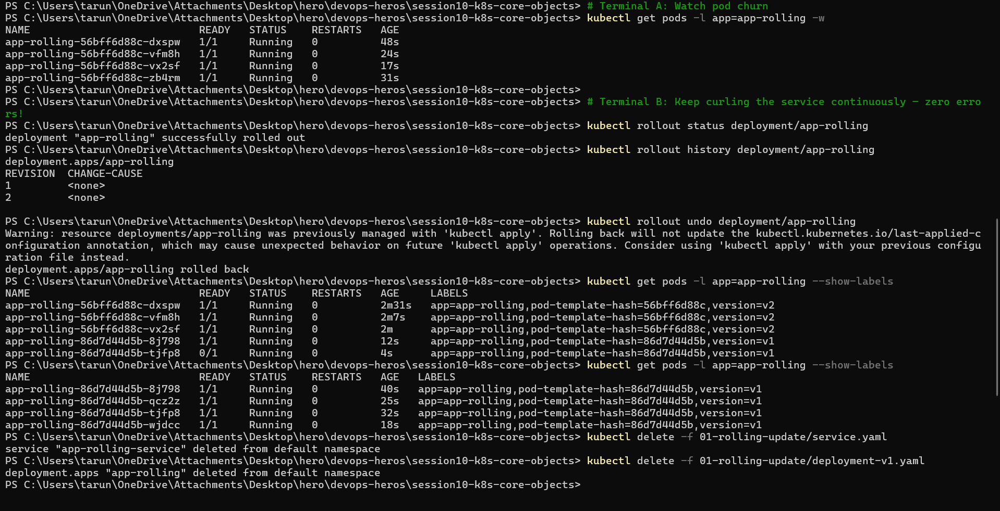

---

## Task 9 — Troubleshooting drills (`troubleshooting/`)

### Drill 1 — a broken image stalls the rollout

`yatri-backend` is running fine on 2 pods. Then a manifest with a tag that does not exist gets applied.

```bash
kubectl apply -f troubleshooting/broken-image.yaml
kubectl rollout status deployment/yatri-backend --timeout=40s
kubectl get pods -l app=yatri-backend
kubectl rollout undo deployment/yatri-backend
```

```
Waiting for deployment "yatri-backend" rollout to finish: 1 out of 3 new replicas have been updated...
error: timed out waiting for the condition

NAME                             READY   STATUS         RESTARTS   AGE
yatri-backend-854c48db65-clz82   1/1     Running        0          40s
yatri-backend-854c48db65-r5djb   1/1     Running        0          114s
yatri-backend-854c48db65-rlcfz   1/1     Running        0          115s
yatri-backend-dbb546fcb-nvk5t    0/1     ErrImagePull   0          40s   <-- new pod, broken image
```

The important part: **the app never went down.** `maxUnavailable: 0` means the old pods are only removed once a new one is Ready — and the new one never became Ready, so the rollout just froze with all 3 old pods serving traffic.

```
$ kubectl rollout undo deployment/yatri-backend
deployment.apps/yatri-backend rolled back
deployment "yatri-backend" successfully rolled out
```

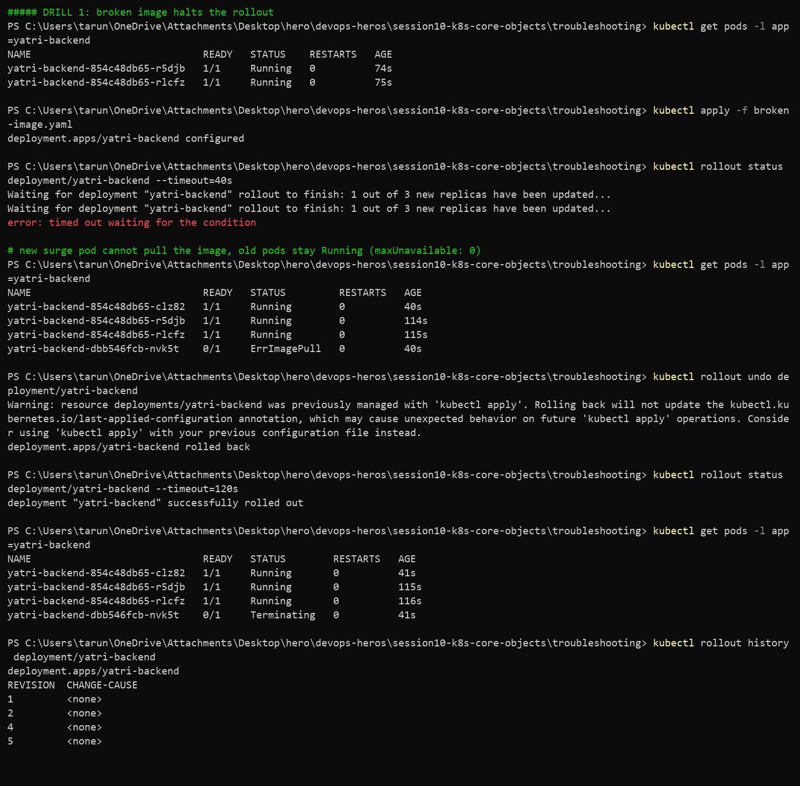

### Drill 2 — selector / template label mismatch

```bash
kubectl apply -f troubleshooting/selector-mismatch.yaml
```

```
The Deployment "selector-error-demo" is invalid: spec.template.metadata.labels:
Invalid value: {"app":"wrong-app-name"}: `selector` does not match template `labels`

$ kubectl get deploy selector-error-demo
Error from server (NotFound): deployments.apps "selector-error-demo" not found
```

This one fails differently from Drill 1 — the API server rejects it during validation, so nothing is ever written to etcd. No pod, no event, nothing to debug on the node.

**Fix:** make `spec.template.metadata.labels.app` equal `spec.selector.matchLabels.app`.

```
$ sed 's/wrong-app-name/correct-app-name/' selector-mismatch.yaml | kubectl apply -f -
deployment.apps/selector-error-demo created
```

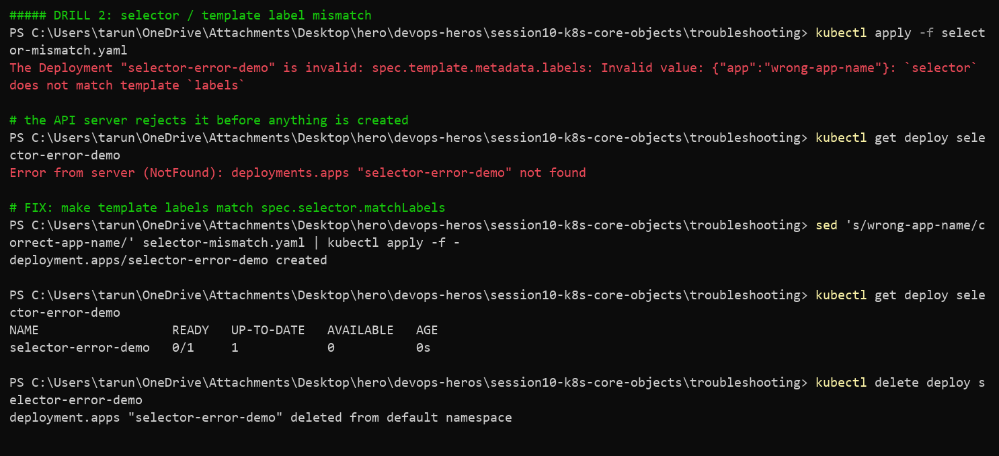

---

## Task 10 — Concepts

### The 4 ports

```
Browser ──► nodePort 30010   (open on every node IP)
               │
               ▼
            port 80          (Service ClusterIP)
               │
               ▼
            targetPort 80    (the pod)
               │
               ▼
            containerPort 80 (nginx inside the container)
```

| Port | Lives on | Who uses it |
| --- | --- | --- |
| `containerPort` | container | documentation only — it does not open anything |
| `targetPort` | pod | where the Service forwards traffic |
| `port` | Service ClusterIP | how other pods call the Service |
| `nodePort` | every node, 30000–32767 | traffic from outside the cluster |

### Labels vs Selectors

- **Label** — the sticker you put on an object: `app: nginx`
- **Selector** — the query that looks for that sticker: `matchLabels: {app: nginx}`

A Deployment selector is **immutable** after creation. That is exactly what Drill 2 above runs into.

### The 4 deployment strategies

| Strategy | Downtime | Extra compute | Use it when |
| --- | --- | --- | --- |
| RollingUpdate | none | +maxSurge | default for stateless apps |
| Recreate | yes | none | DB schema change, version conflict |
| Blue-Green | none | 2× | instant rollback is required |
| Canary | none | +canary pods | you want real prod traffic to test on |

### maxSurge vs maxUnavailable

For `replicas: 4, maxSurge: 1, maxUnavailable: 0`:

```
max pods during rollout = 4 + 1 = 5
min available pods      = 4 - 0 = 4   -> 100% capacity throughout
```

Percentages round in opposite directions: `maxSurge` rounds **up**, `maxUnavailable` rounds **down**. For 10 replicas at 25%/25% that is surge 3, unavailable 2.

### Requests vs Limits

- **Request** — what the scheduler reserves. Set it too high and the pod stays `Pending` (Task 5.1).
- **Limit** — the cgroup ceiling. Over the CPU limit the container is throttled; over the memory limit it is OOMKilled.

`1 GB = 1,000,000,000 bytes` (decimal) but `1 GiB = 1,073,741,824 bytes` (binary). Kubernetes uses `Mi` / `Gi`, so `memory: 64Mi` is 67.1 MB, not 64 MB.

---

## Task 11 — Blue-Green (`02-blue-green/`)

Both environments run at once; the Service selector decides which one is live.

```bash
kubectl apply -f 02-blue-green/deployment-blue.yaml
kubectl apply -f 02-blue-green/deployment-green.yaml
kubectl apply -f 02-blue-green/service-blue.yaml     # live = blue
kubectl apply -f 02-blue-green/service-green.yaml    # the switch
kubectl apply -f 02-blue-green/service-blue.yaml     # instant rollback
```

Nothing gets deployed or pulled at cutover time — only the selector changes, so it flips in milliseconds. The cost is 2× compute while both slots are up.

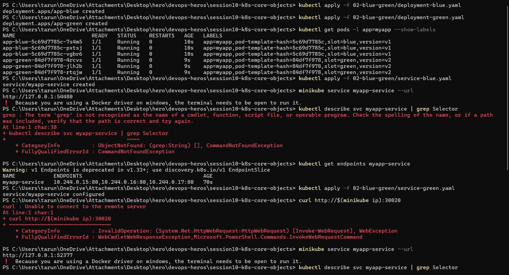

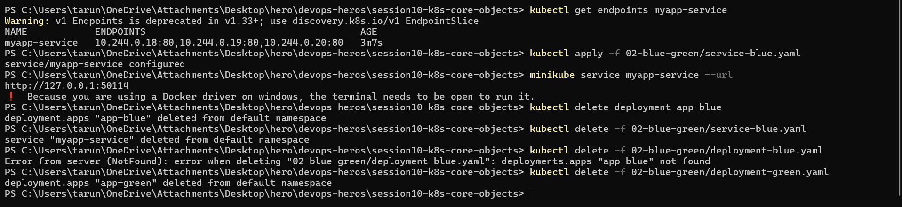
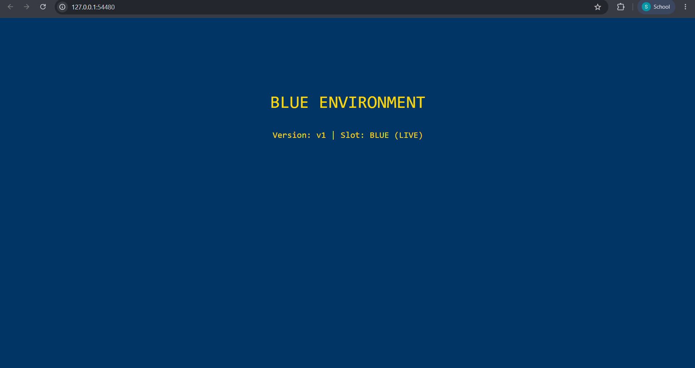
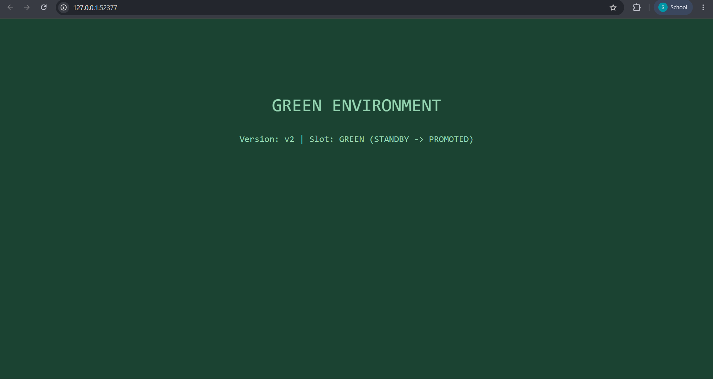
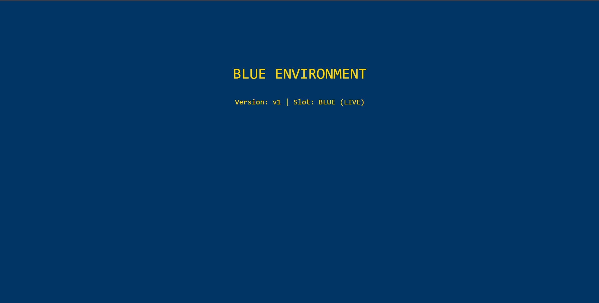

---

## Task 12 — Canary (`03-canary/`)

9 stable + 1 canary behind one Service = roughly 10% of traffic on v2.

```bash
kubectl apply -f 03-canary/deployment-stable.yaml
kubectl apply -f 03-canary/service.yaml
kubectl apply -f 03-canary/deployment-canary.yaml
kubectl scale deployment app-canary --replicas=3    # move to 30%
kubectl scale deployment app-canary --replicas=0    # abort the canary
```

Both deployments share the label the Service selects on, so they land in the same endpoint pool. The split is only the pod ratio — the Service balances evenly across endpoints. Real percentage control needs an ingress or a service mesh.

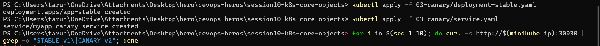
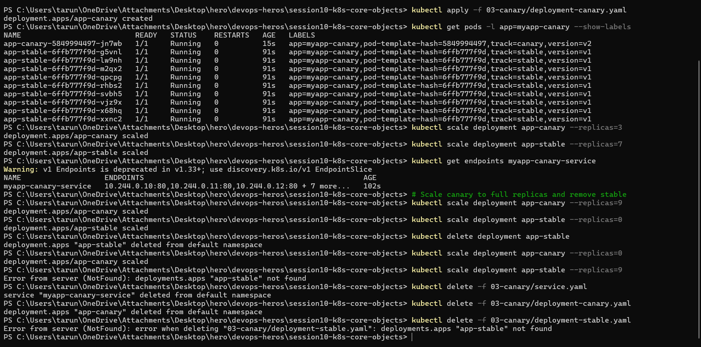

---

## Task 13 — Recreate (`04-recreate/`)

`strategy.type: Recreate` — every v1 pod is killed before any v2 pod starts, so there is a real outage window.

```bash
kubectl apply -f 04-recreate/deployment-v1.yaml
kubectl apply -f 04-recreate/service.yaml
kubectl apply -f 04-recreate/deployment-v2.yaml
kubectl rollout undo deployment/app-recreate
```

```
VERSION: v1
[OUTAGE] Connection refused / 0 pods alive
VERSION: v2 (UPGRADED)
```

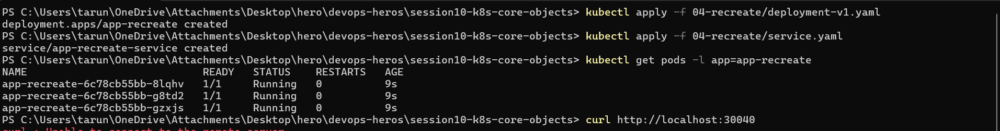
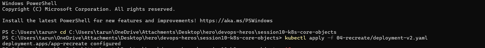
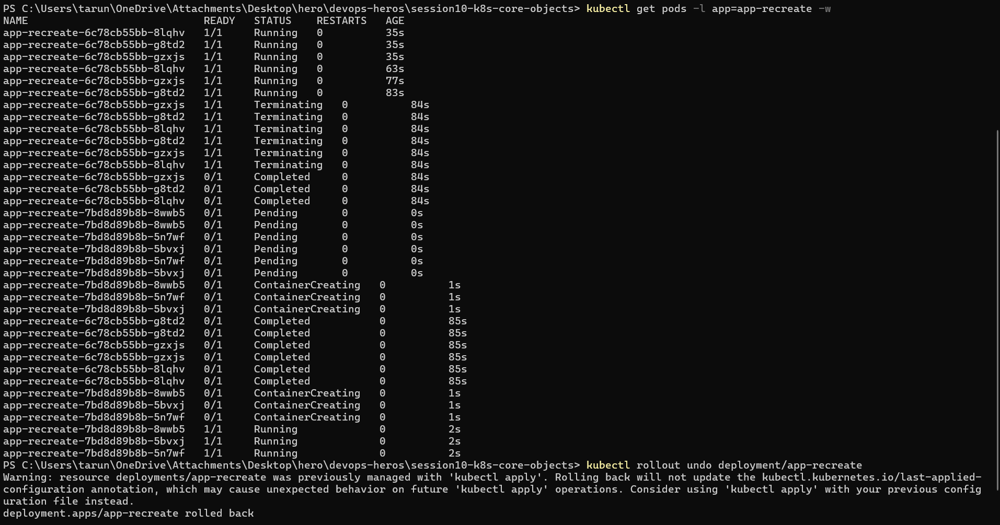
