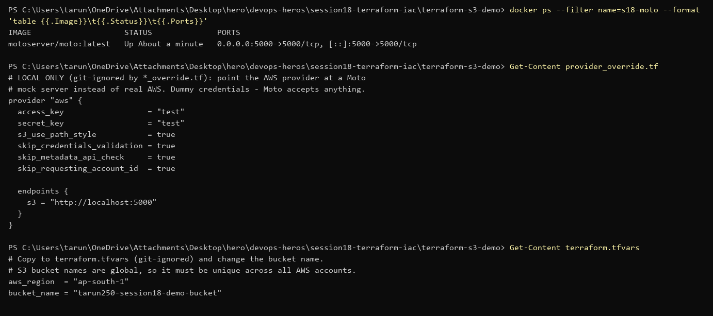
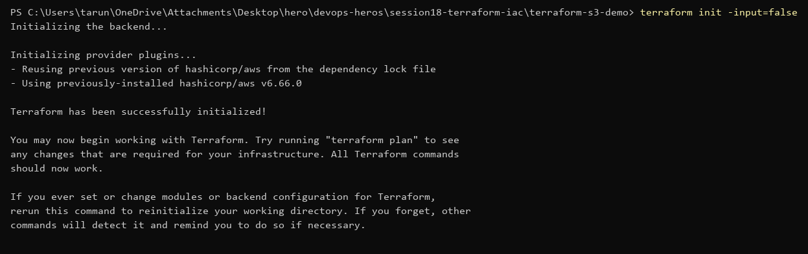
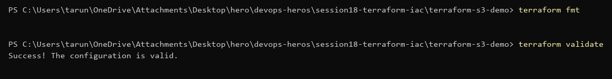
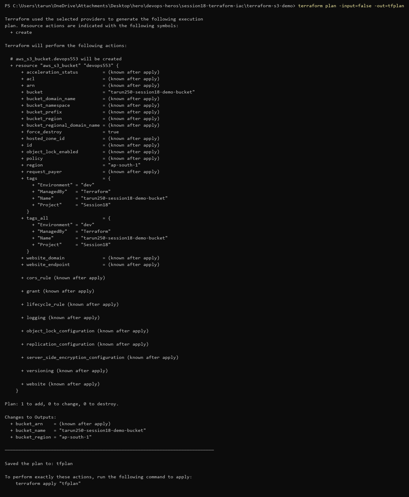
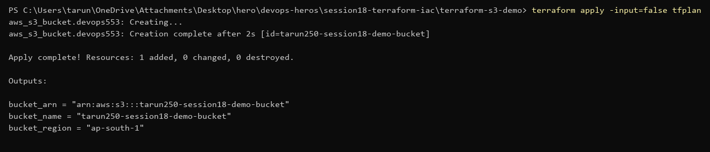
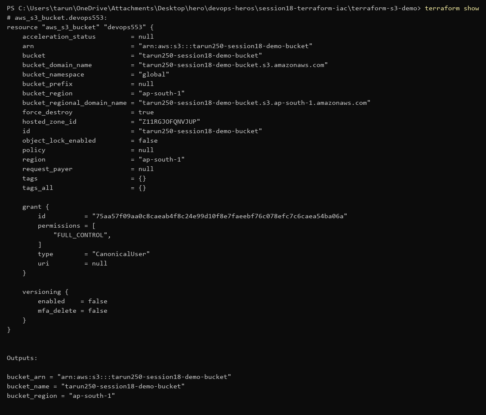
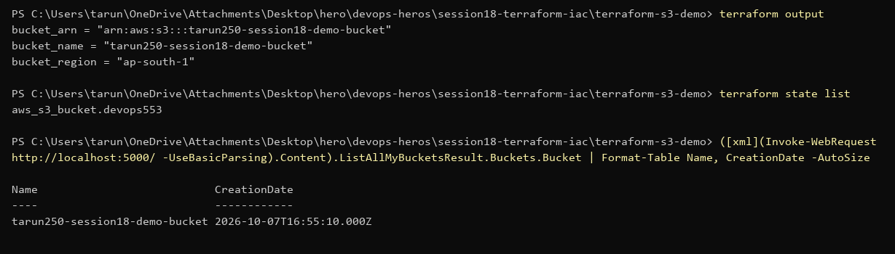
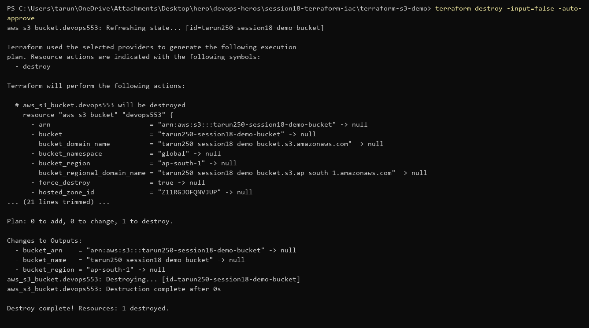
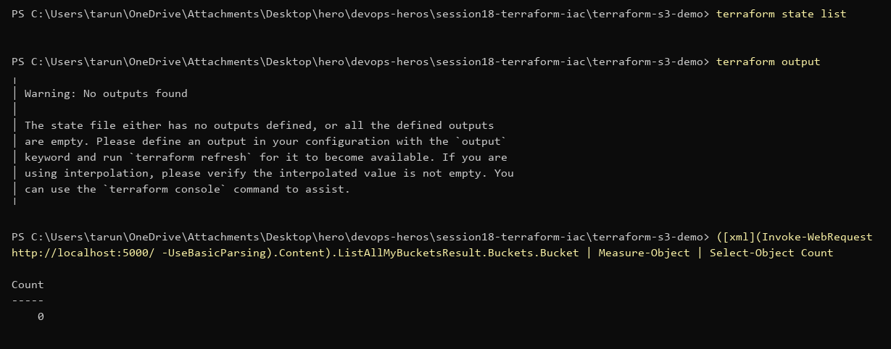

# Session 18 — Terraform & Infrastructure as Code (Submission)

Terraform v1.16.2, AWS provider `~> 6.0`, Windows / PowerShell.

> No AWS account, so the full workflow (plan → apply → show → output → destroy) was run against a local AWS mock (Moto). Details below.

## Terraform CLI

```powershell
terraform version
```


## S3 demo (`terraform-s3-demo/`)

| File | Purpose |
|---|---|
| `terraform.tf` | required Terraform + AWS provider versions |
| `providers.tf` | AWS provider, region from variable |
| `variables.tf` | `aws_region`, `bucket_name` |
| `main.tf` | `aws_s3_bucket` with tags, `force_destroy` |
| `outputs.tf` | bucket name, ARN, region |
| `terraform.tfvars.example` | sample values; copy to `terraform.tfvars` (git-ignored on purpose, since tfvars files often hold secrets) |

```powershell
terraform fmt -check -recursive
terraform init
```


```powershell
terraform validate
terraform providers
```


## Full workflow: plan → apply → show → output → destroy

> **No AWS account**, so this ran against **[Moto](https://github.com/getmoto/moto)** — an open-source AWS mock server in Docker that implements the real S3 API. Terraform, the AWS provider and every command are real; only the endpoint is local. With an AWS account the only change is deleting the override file below and running `aws configure`.

The Moto server, plus a **local, git-ignored** `provider_override.tf` that points the provider at it (dummy credentials, Moto accepts anything), and `terraform.tfvars`:

```hcl
provider "aws" {
  access_key                  = "test"
  secret_key                  = "test"
  s3_use_path_style           = true
  skip_credentials_validation = true
  skip_metadata_api_check     = true
  skip_requesting_account_id  = true
  endpoints {
    s3 = "http://localhost:5000"
  }
}
```


**terraform init**


**terraform fmt / validate**


**terraform plan** — 1 to add


**terraform apply**


**terraform show** — what's now in state


**terraform output** + `state list` + the bucket listed by the S3 API


**terraform destroy**


After destroy: state empty, no outputs, 0 buckets.


On real AWS (same commands, no override file):
```powershell
aws configure
copy terraform.tfvars.example terraform.tfvars   # bucket_name must be globally unique
terraform init; terraform plan -out=tfplan; terraform apply tfplan
terraform show; terraform output
terraform destroy
```

## All labs (01–09) validate

`init -backend=false` + `validate` in every lab folder:


## Task 2 — AWS services research

[`aws-services/`](./aws-services/README.md)

| # | Service | Covers |
|---|---|---|
| 01 | [IAM](./aws-services/01-iam/README.md) | users, groups, roles, policies, permissions, least privilege, best practices |
| 02 | [EC2](./aws-services/02-ec2/README.md) | AMI, instance types, key pairs, security groups, EBS, public vs private IP, lifecycle |
| 03 | [S3](./aws-services/03-s3/README.md) | buckets, objects, storage classes, versioning, lifecycle, encryption, bucket policies |
| 04 | [VPC](./aws-services/04-vpc/README.md) | CIDR, subnets, route tables, IGW, NAT, security groups, NACLs, public vs private |
| 05 | [DynamoDB & RDS](./aws-services/05-dynamodb-rds/README.md) | partition/sort keys, items, attributes; engines, backups, Multi-AZ, read replicas |
