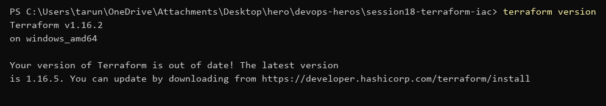
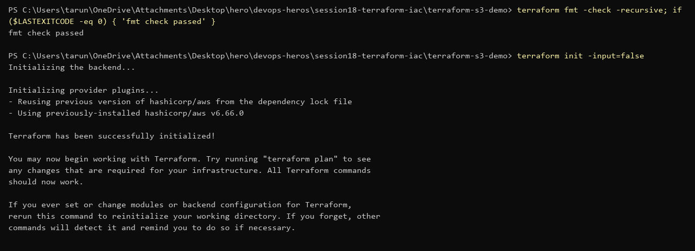
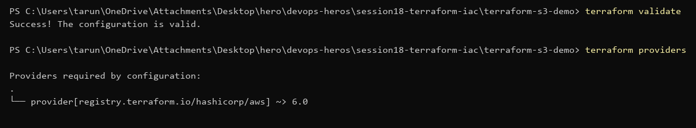
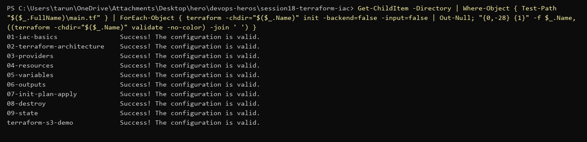

# Session 18 — Terraform & Infrastructure as Code (Submission)

Terraform v1.16.2, AWS provider `~> 6.0`, Windows / PowerShell.

> No AWS account/credentials on this machine, so `terraform plan` / `apply` were **not** run.
> All configs are formatted, initialised and validated.

## Terraform CLI

```powershell
terraform version
```


## S3 demo (`terraform-s3-demo/`)

| File | Purpose |
|---|---|
| `terraform.tf` | required Terraform + AWS provider versions |
| `providers.tf` | AWS provider, region from variable |
| `variables.tf` | `aws_region`, `bucket_name` |
| `main.tf` | `aws_s3_bucket` with tags, `force_destroy` |
| `outputs.tf` | bucket name, ARN, region |
| `terraform.tfvars.example` | sample values; copy to `terraform.tfvars` (git-ignored on purpose, since tfvars files often hold secrets) |

```powershell
terraform fmt -check -recursive
terraform init
```


```powershell
terraform validate
terraform providers
```


To actually create it (needs `aws configure` first) — **not run: no AWS credentials**:
```powershell
copy terraform.tfvars.example terraform.tfvars   # set a unique bucket_name
terraform plan
terraform apply
terraform show
terraform output
terraform destroy
```

## All labs (01–09) validate

`init -backend=false` + `validate` in every lab folder:



## Task 2 — AWS services research

[`aws-services/`](./aws-services/README.md)

| # | Service | Covers |
|---|---|---|
| 01 | [IAM](./aws-services/01-iam/README.md) | users, groups, roles, policies, permissions, least privilege, best practices |
| 02 | [EC2](./aws-services/02-ec2/README.md) | AMI, instance types, key pairs, security groups, EBS, public vs private IP, lifecycle |
| 03 | [S3](./aws-services/03-s3/README.md) | buckets, objects, storage classes, versioning, lifecycle, encryption, bucket policies |
| 04 | [VPC](./aws-services/04-vpc/README.md) | CIDR, subnets, route tables, IGW, NAT, security groups, NACLs, public vs private |
| 05 | [DynamoDB & RDS](./aws-services/05-dynamodb-rds/README.md) | partition/sort keys, items, attributes; engines, backups, Multi-AZ, read replicas |
