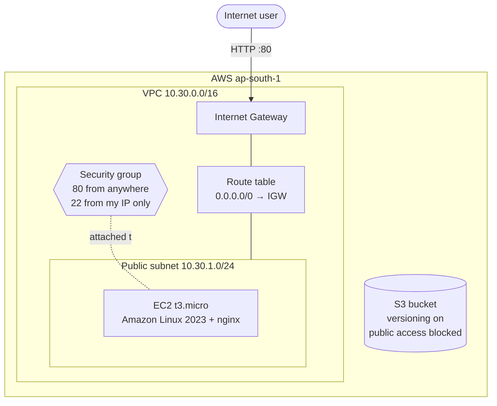
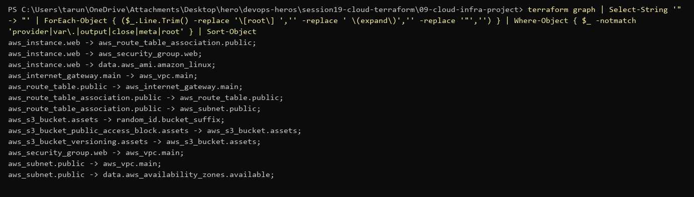
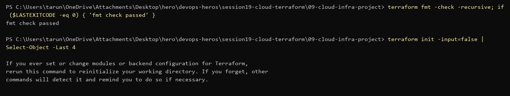

# Session 19 — End-to-End Cloud Infrastructure with Terraform

VPC + public subnet + Internet Gateway + route table + security group + EC2 (nginx) + S3, all in Terraform.

> No AWS credentials on this machine, so `plan` / `apply` / `destroy` were **not** run. The code is formatted, initialised and validated; the exact commands to run it are below.

## Architecture



## Files

| File | Purpose |
|---|---|
| `versions.tf` | Terraform + provider versions (`aws ~> 6.0`, `random ~> 3.6`) |
| `provider.tf` | AWS provider, region from a variable, default tags on every resource |
| `variables.tf` | region, project name, CIDRs, instance type, SSH CIDR |
| `main.tf` | all resources |
| `outputs.tf` | VPC/subnet/SG/instance IDs, public IP, website URL, bucket name |
| `terraform.tfvars.example` | sample values (copy to `terraform.tfvars`, which is git-ignored) |

## What it demonstrates

| Concept | Where |
|---|---|
| **Providers** | `aws` + `random` in `versions.tf`, configured in `provider.tf` |
| **Variables** | `variables.tf`, overridden by `terraform.tfvars` |
| **Resources** | VPC, subnet, IGW, route table + association, security group, EC2, S3 bucket + versioning + public access block, random suffix |
| **Data sources** | latest Amazon Linux 2023 AMI, available AZs |
| **Outputs** | `outputs.tf` — printed after `apply`, `terraform output` |
| **Dependencies** | implicit (`vpc_id = aws_vpc.main.id`) and one explicit `depends_on` (below) |
| **State** | `terraform.tfstate` maps each resource block to the real AWS ID (below) |

## Dependencies

Terraform builds a graph from references and creates things in the right order (and in parallel where it can). Implicit example: the subnet uses `aws_vpc.main.id`, so the VPC is created first.

Explicit example: the EC2 user-data installs nginx from the internet, but nothing in `aws_instance.web` references the route table, so Terraform could launch it before the subnet has an internet route. `depends_on = [aws_route_table_association.public]` fixes the order.

```powershell
terraform graph
```


## Commands run

```powershell
terraform fmt -check -recursive
terraform init
```


```powershell
terraform validate
```


## Full workflow (needs AWS credentials)

```powershell
aws configure                                    # access key of an IAM user/role, never committed
copy terraform.tfvars.example terraform.tfvars   # set allowed_ssh_cidr to <your-ip>/32
terraform init
terraform plan -out tfplan                       # 11 resources to add
terraform apply tfplan
terraform output website_url                     # open it → nginx page
terraform state list                             # what Terraform is tracking
terraform state show aws_instance.web
terraform destroy                                # avoid AWS charges
```

## Terraform state

- After `apply`, `terraform.tfstate` records every resource with its real ID (`vpc-0abc…`, `i-0def…`) and attributes.
- `plan` compares **config** vs **state** vs **real AWS** to work out what to change.
- It can contain secrets in plain text, so it is git-ignored. For teams, use a remote backend (S3 with locking) so everyone shares one state and two `apply`s can't run at once.
- Commands: `terraform state list`, `terraform state show <addr>`, `terraform state mv`, `terraform state rm`.

## Security choices

- SSH only from one IP (`allowed_ssh_cidr`), never `0.0.0.0/0`.
- S3: versioning on, all public access blocked.
- No credentials in any `.tf` file; `terraform.tfvars` and state files are git-ignored.
