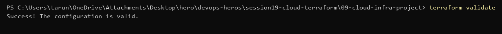

# Session 19 — Cloud & Terraform in Action (Submission)

> No AWS account. The main project (`09-cloud-infra-project`) ran the full `plan` → `apply` → `destroy` workflow against a local AWS mock (Moto) — see its README. The other folders are formatted, initialised and validated.

## End-to-end project — VPC + Subnet + SG + EC2 + S3 (`09-cloud-infra-project/`)

The homework's suggested architecture, with an architecture diagram, dependencies, state, and a full plan → apply → destroy run (local AWS mock):
**[09-cloud-infra-project/README.md](./09-cloud-infra-project/README.md)**



## Mini project — VPC with Terraform (`08-mini-project/`)

What it builds:

| Resource | Purpose |
|---|---|
| `aws_vpc.main` | the private network, `10.20.0.0/16` |
| `aws_subnet.public` | `10.20.1.0/24`, auto-assign public IP |
| `aws_internet_gateway.main` | lets the VPC reach the internet |
| `aws_route_table.public` + association | `0.0.0.0/0 → IGW` for the public subnet |
| `aws_security_group.web` | HTTP 80 + HTTPS 443 inbound, all outbound |

```powershell
terraform fmt -check
terraform init
```


```powershell
terraform validate
```


Resources, outputs and variables in the config:


## All Terraform folders validate

`06-terraform-vpc`, `07-terraform-workflow` (S3), `08-mini-project`:


To run for real (after `aws configure`):
```powershell
terraform plan
terraform apply
terraform output
terraform state list
terraform destroy
```

## EC2 extension questions

1. **Subnet?** The public subnet — it has the route to the IGW.
2. **Security group?** `web` SG (80/443 in).
3. **Why IGW route?** Without `0.0.0.0/0 → IGW` the subnet has no path to the internet, so it isn't really public.
4. **What else for reachability?** A public IP (auto-assign or Elastic IP), SG/NACL allowing the port, and the app listening on it.
5. **Why not SSH from `0.0.0.0/0`?** Anyone can brute-force port 22. Allow only your IP, or use SSM Session Manager.
