# Session 20 — Monitoring, Observability & GitOps (Submission)

Prometheus + Grafana with Docker Compose, Argo CD on Minikube.

Observability notes (three pillars, why it's needed, tools, Kubernetes observability): **[observability.md](./observability.md)**

## Prometheus + Grafana (`04-grafana/`)

```powershell
docker compose up -d
docker compose ps
```
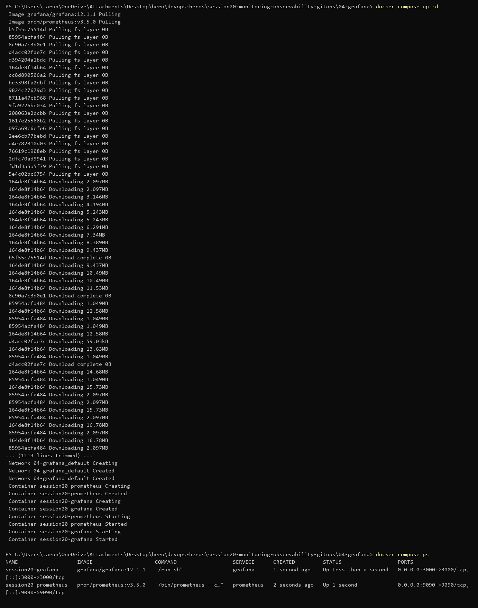

Prometheus scraping itself every 5s — target is `up`:
```powershell
(Invoke-RestMethod 'http://localhost:9090/api/v1/targets').data.activeTargets
```
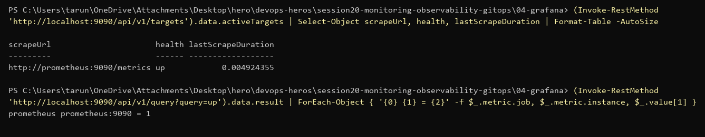
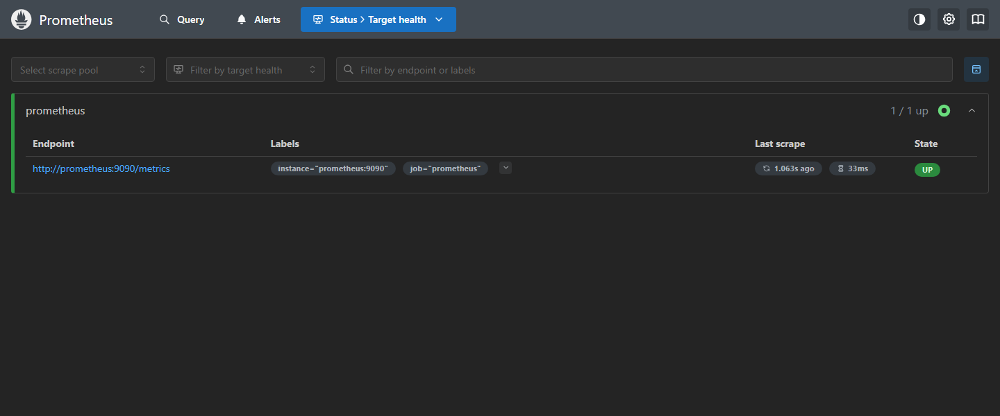

Grafana → Prometheus data source (`http://prometheus:9090`, the compose service name), and Grafana querying `up` through it:

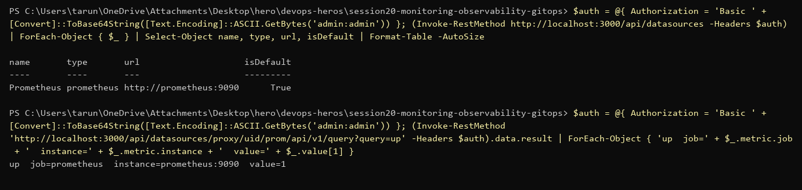

Dashboard with 4 panels: `sum(up)`, `rate(prometheus_http_requests_total[1m])` by handler, `process_resident_memory_bytes`, `scrape_samples_scraped`.

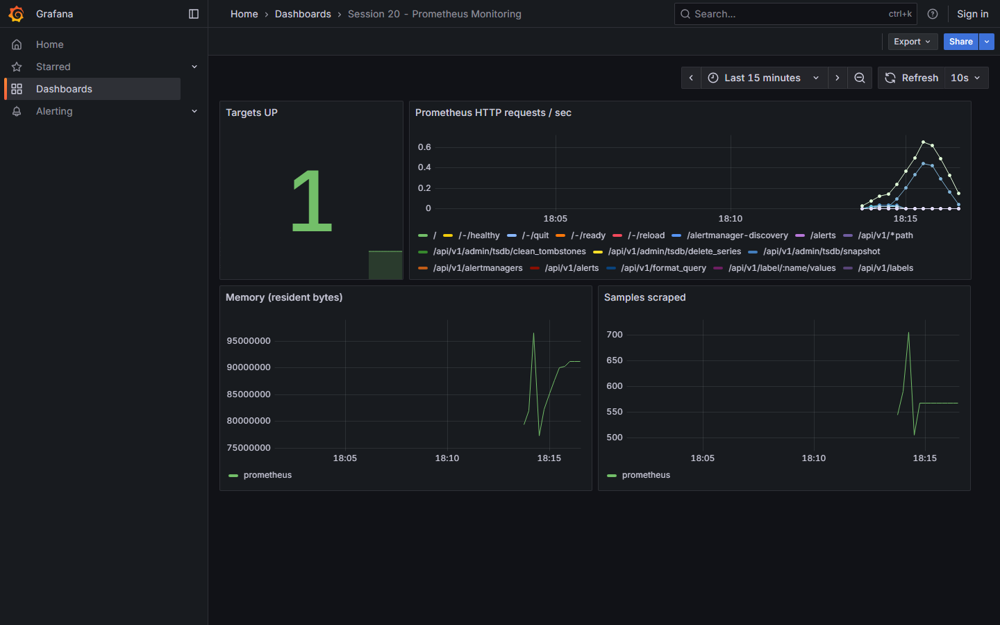

Data source and dashboard were added through Grafana's HTTP API (same result as clicking through the UI).

## Monitoring a real app (`09-app-monitoring/`)

The labs above only scrape Prometheus itself, so I added a small Flask app that exposes its own metrics with `prometheus_client`:

| Metric | Type | Meaning |
|---|---|---|
| `app_requests_total{endpoint,status}` | counter | requests by endpoint and status code |
| `app_request_duration_seconds` | histogram | latency per endpoint |
| `app_orders_total` | counter | business metric: orders placed |

`/order` sleeps 10–300 ms and fails ~10% of the time, so latency and errors show up on the graphs.

Prometheus scrapes `app:8080/metrics` every 5s (`prometheus.yml`). Grafana's data source and dashboard are provisioned from files in `grafana/`, so nothing is clicked by hand.

```powershell
docker compose up -d --build
docker compose ps
```
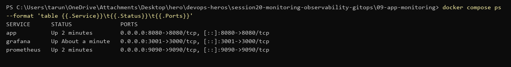

```powershell
curl.exe -s http://localhost:8080/metrics
```
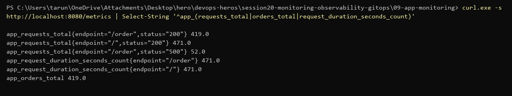

Both targets UP:

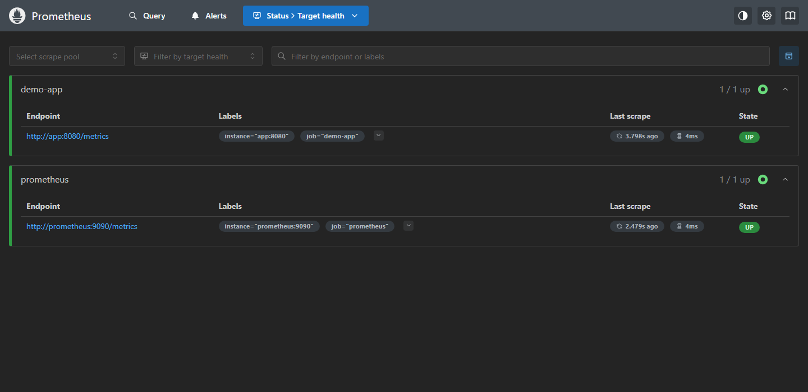

Dashboard after ~5 min of traffic (Grafana on http://localhost:3001):

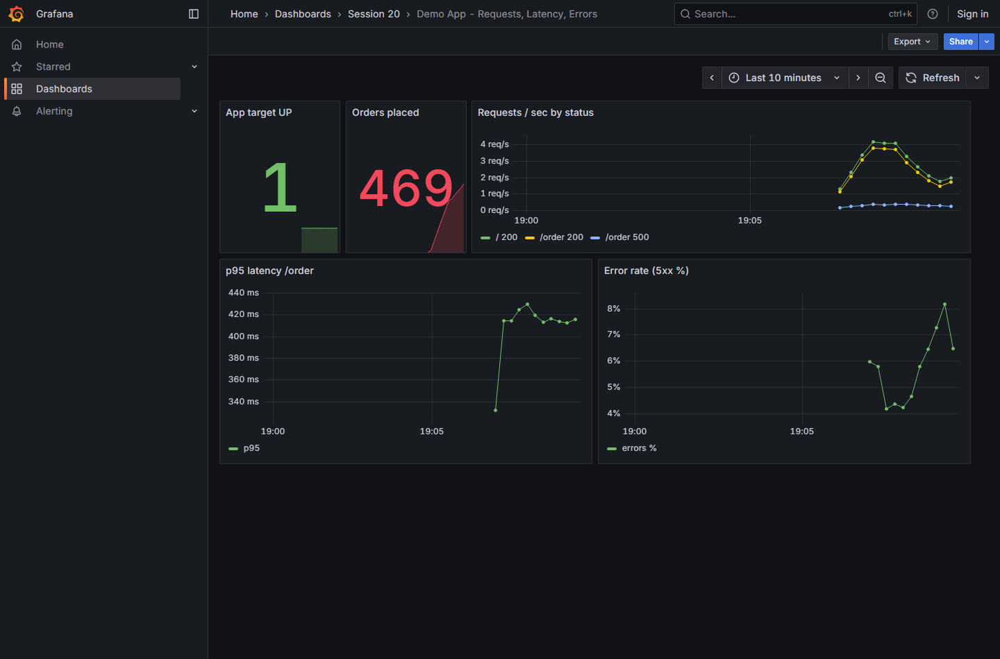

PromQL used:
```text
sum by (endpoint, status) (rate(app_requests_total[1m]))
histogram_quantile(0.95, sum by (le) (rate(app_request_duration_seconds_bucket{endpoint="/order"}[1m])))
100 * sum(rate(app_requests_total{status="500"}[1m])) / sum(rate(app_requests_total[1m]))
```

### Logs, alerts, CPU / memory, health

| Homework item | How it's shown |
|---|---|
| Metrics | `app_requests_total`, `app_request_duration_seconds`, `app_orders_total` |
| Logs | app writes one `key=value` line per event (`level=ERROR event=order_failed …`) |
| Alerts | Prometheus rules in [`alerts.yml`](./09-app-monitoring/alerts.yml): `AppDown`, `HighErrorRate`, `HighLatencyP95`, `HighCPU` |
| CPU utilization | `rate(process_cpu_seconds_total[1m])` panel + `HighCPU` alert |
| Memory utilization | `process_resident_memory_bytes` panel |
| Application health | `/health` endpoint + `up{job="demo-app"}` + `AppDown` alert |

**Alerts** — `HighErrorRate` (error rate per endpoint > 5% for 1 minute) is firing for `/order`, which fails ~10% of the time on purpose:

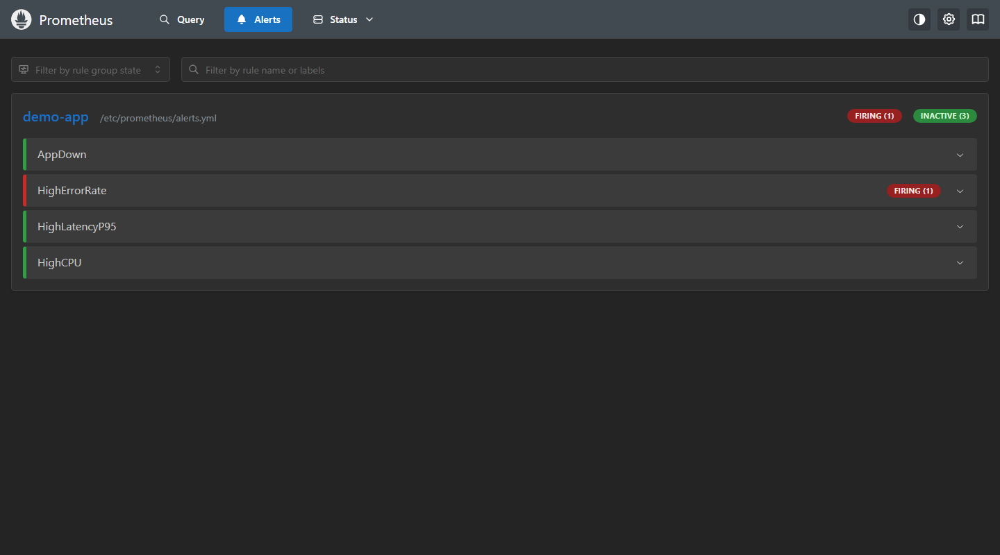
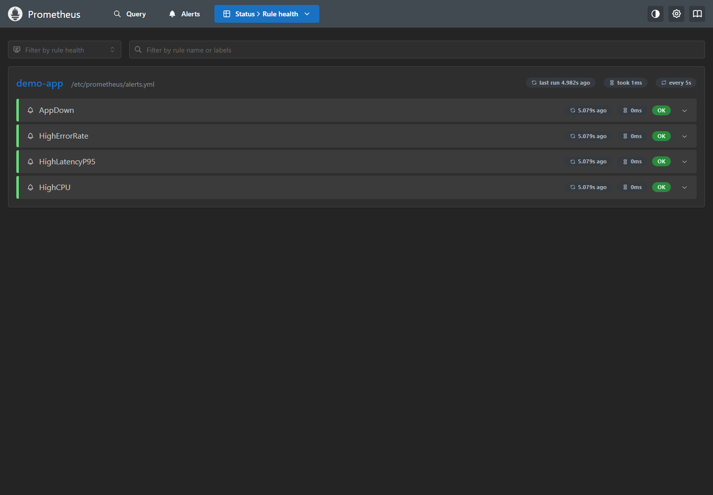

My first version divided `/order` errors by *all* requests (including `/`), which sits right at ~5% and kept resetting the 1-minute timer, so it never fired. Grouping `by (endpoint)` fixed it.

**CPU + memory** panels added to the dashboard:

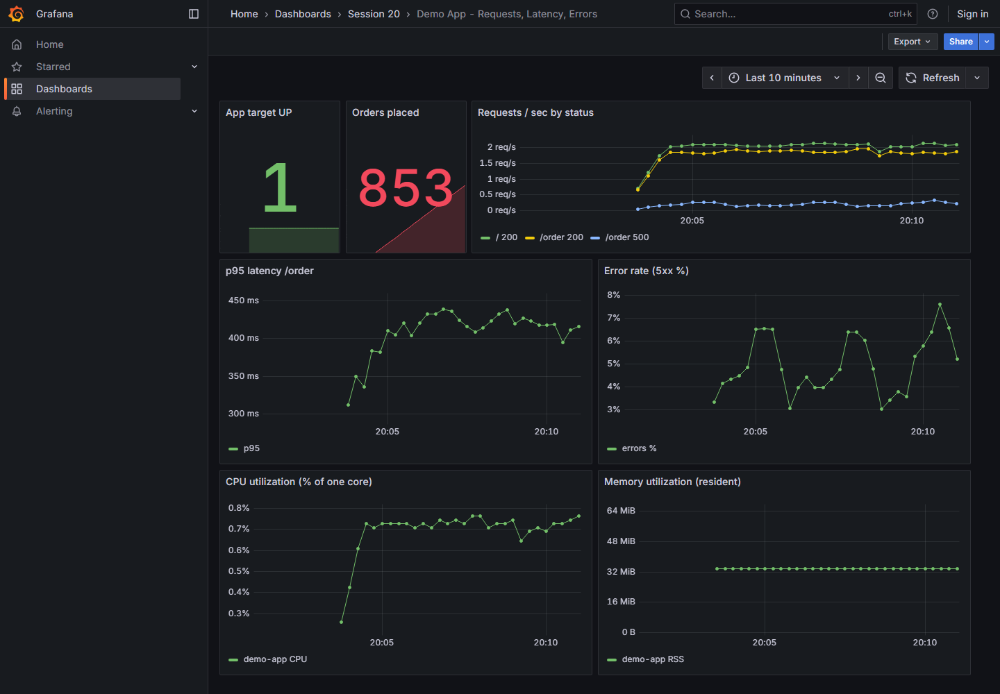

**Logs**

```powershell
docker compose logs app --tail=12
```
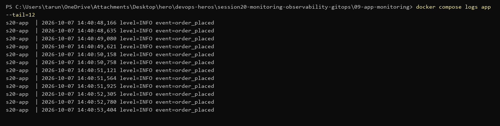

Counting errors vs successful orders from the logs (last minute) — 13 vs 111, about 10%, matching the metrics:

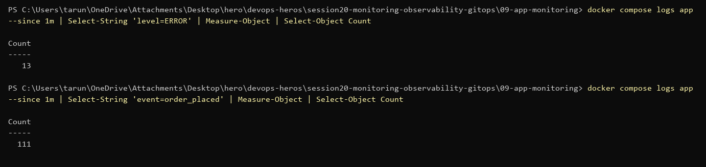

## Mini project — GitOps with Argo CD (`08-mini-project/`)

**Install Argo CD**
```powershell
kubectl create namespace argocd
kubectl apply -n argocd --server-side -f https://raw.githubusercontent.com/argoproj/argo-cd/stable/manifests/install.yaml
kubectl get pods -n argocd
```
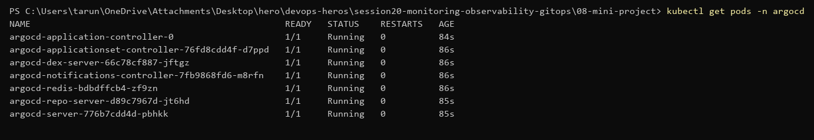

**Application** — `app/argocd-application.yaml` points at this repo (`tarun250/devops-heros`, path `session20-monitoring-observability-gitops/08-mini-project/app`). `directory.exclude` keeps the Application file itself out of the synced manifests. Auto-sync with `prune` + `selfHeal`.

```powershell
kubectl apply -f app/argocd-application.yaml
kubectl get applications -n argocd
kubectl get all -n session20
```
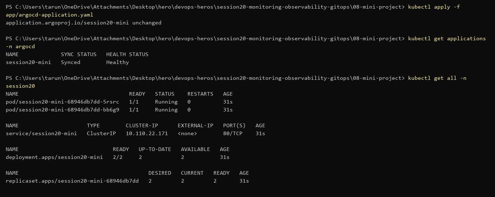

**Self-healing** — scaled to 5 by hand, Argo CD put it back to 2 (what Git says) within ~15s.

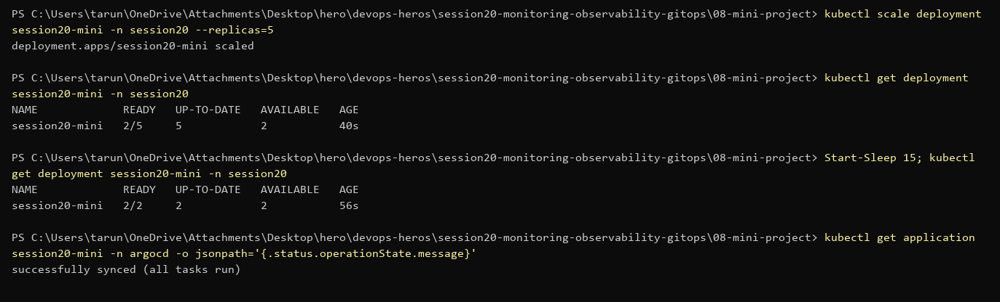

**Git change** — `replicas: 2 → 3`, commit, push. No `kubectl apply`.

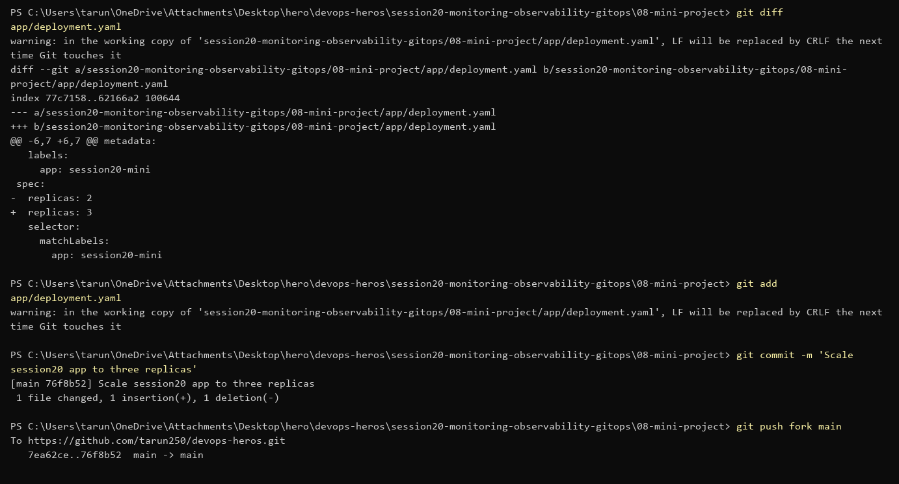

Argo CD picked up the commit on its next poll (~3 min) and scaled to 3:

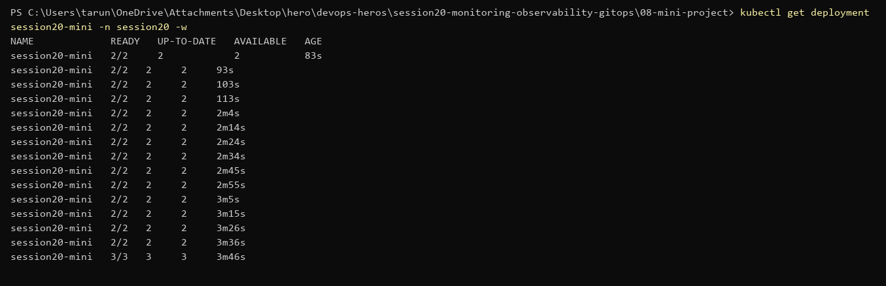

Synced revision = the pushed commit `76f8b52`:

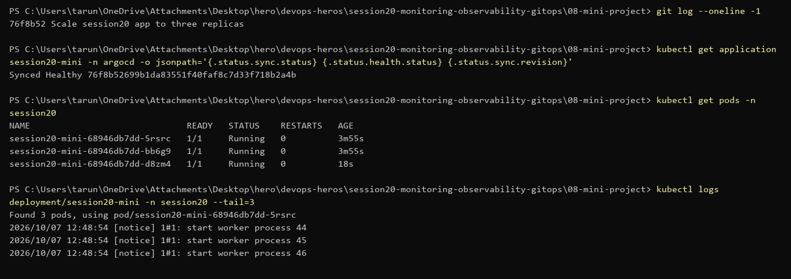

## Viva questions

1. **Monitoring vs observability** — monitoring watches known metrics/alerts; observability lets you ask new questions from metrics, logs and traces.
2. **Metrics / logs / traces** — numbers over time / event text / one request's path across services.
3. **Prometheus** — pull-based time-series DB; scrapes `/metrics` endpoints, queried with PromQL.
4. **Grafana** — dashboards and alerts on top of data sources like Prometheus.
5. **GitOps** — Git holds the desired state; an agent in the cluster makes the cluster match it.
6. **Git as source of truth** — every change is a reviewed, versioned commit; rollback = `git revert`.
7. **Argo CD** — watches a Git path and syncs it into Kubernetes, shows drift.
8. **Desired state** — what's in Git (3 replicas).
9. **Actual state** — what's running in the cluster right now.
10. **Reconciliation** — the loop that compares desired vs actual and fixes the difference.
11. **Self-healing** — manual changes in the cluster are reverted to match Git.
12. **Replicas 2 → 3 in Git** — Argo CD detects the new commit, syncs, Deployment scales to 3.
