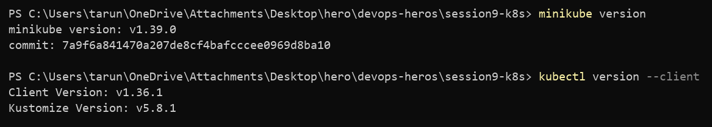
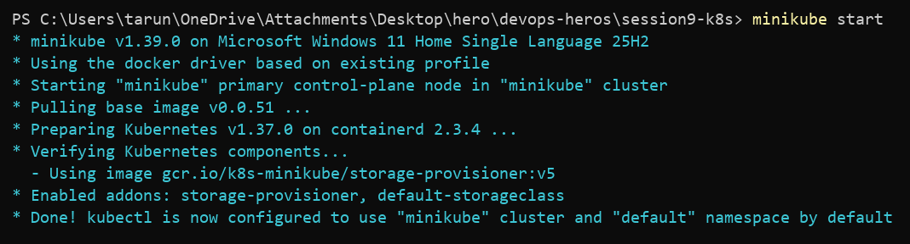
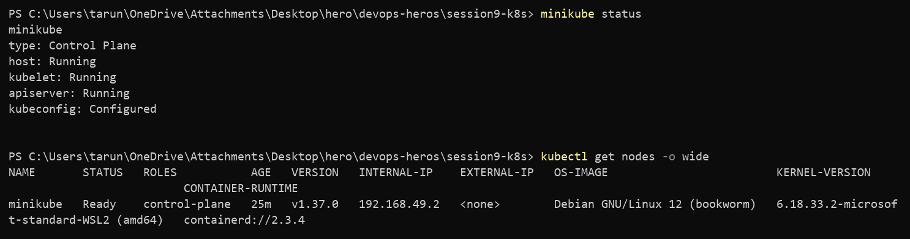
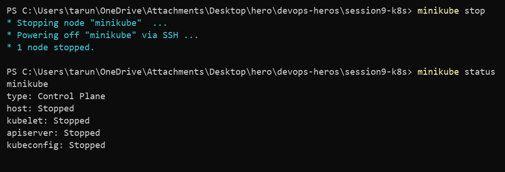

# Session 9 — Kubernetes Fundamentals & Cluster Architecture

**Repo:** devops-heros / `session9-k8s`
**Setup:** Windows 11 + Docker Desktop + Minikube (docker driver)

---

## Task 1 — Install Minikube & kubectl

Check that both CLIs are installed before touching the cluster.

```bash
minikube version
kubectl version --client
```

**Output**

```
minikube version: v1.39.0
commit: 7a9f6a841470a207de8cf4bafcccee0969d8ba10

Client Version: v1.36.1
Kustomize Version: v5.8.1
```



---

## Task 2 — Start the cluster

Boots a single-node Kubernetes cluster inside a Docker container.

```bash
minikube start
```

**Output**

```
* minikube v1.39.0 on Microsoft Windows 11 Home Single Language 25H2
* Using the docker driver based on existing profile
* Starting "minikube" primary control-plane node in "minikube" cluster
* Pulling base image v0.0.51 ...
* Preparing Kubernetes v1.37.0 on containerd 2.3.4 ...
* Verifying Kubernetes components...
  - Using image gcr.io/k8s-minikube/storage-provisioner:v5
* Enabled addons: storage-provisioner, default-storageclass
* Done! kubectl is now configured to use "minikube" cluster and "default" namespace by default
```



---

## Task 3 — Verify the cluster is healthy

`minikube status` checks the control plane processes, `get nodes` confirms the node is `Ready`.

```bash
minikube status
kubectl get nodes -o wide
```

**Output**

```
minikube
type: Control Plane
host: Running
kubelet: Running
apiserver: Running
kubeconfig: Configured

NAME       STATUS   ROLES           AGE   VERSION   INTERNAL-IP    EXTERNAL-IP   OS-IMAGE                         CONTAINER-RUNTIME
minikube   Ready    control-plane   25m   v1.37.0   192.168.49.2   <none>        Debian GNU/Linux 12 (bookworm)   containerd://2.3.4
```

Node IP is `192.168.49.2` — that is a Docker bridge address, not a real LAN IP. Runtime is containerd, not Docker.



---

## Task 4 — Stop the cluster

Powers the node off cleanly and frees the RAM/CPU back to the laptop.

```bash
minikube stop
minikube status
```

**Output**

```
* Stopping node "minikube"  ...
* Powering off "minikube" via SSH ...
* 1 node stopped.

minikube
type: Control Plane
host: Stopped
kubelet: Stopped
apiserver: Stopped
kubeconfig: Stopped
```



---

## Task 5 — Cluster architecture

```
                        CONTROL PLANE (minikube node)
   +-----------+     +------------------+     +----------------+
   |   etcd    |<--->|  kube-apiserver  |<--->| kube-scheduler |
   +-----------+     +--------+---------+     +----------------+
                              |
                              v
                  +--------------------------+
                  |  kube-controller-manager |
                  +--------------------------+
                              |
   ---------------------------+---------------------------
                              |
                        WORKER NODE
        +-----------+                +------------+
        |  kubelet  |                | kube-proxy |
        +-----+-----+                +------------+
              |
              v
      +----------------------+
      | containerd (CRI)     |
      +----------------------+
              |
        +-----+-----+
        |   Pods    |
        +-----------+
```

### Control plane

| Component | What it does |
| --- | --- |
| **kube-apiserver** | The only front door. Every `kubectl` command, every controller, every kubelet talks through it. Nothing else touches etcd directly. |
| **etcd** | Key-value store holding the entire cluster state — every object you create lives here. |
| **kube-scheduler** | Watches for pods with no node assigned and picks the best node based on CPU/memory requests, taints, affinity. |
| **kube-controller-manager** | Runs the reconciliation loops: *desired state vs current state*. Node controller, ReplicaSet controller, endpoint controller all live here. |

### Worker node

| Component | What it does |
| --- | --- |
| **kubelet** | Node agent. Takes PodSpecs from the API server, tells the runtime to start containers, reports health back. |
| **kube-proxy** | Maintains iptables/IPVS rules so Service IPs actually route to pod IPs. |
| **Container runtime (CRI)** | Actually runs containers. This cluster uses **containerd 2.3.4** — Docker is not in the path anymore. |
| **Pod** | Smallest deployable unit. One or more containers sharing one IP and volumes. |

### How a `kubectl apply` flows

1. `kubectl` → **apiserver** (authn/authz)
2. apiserver writes the object → **etcd**
3. **scheduler** sees an unscheduled pod → assigns a node
4. **kubelet** on that node sees the assignment → asks **containerd** to pull + run
5. kubelet reports status → apiserver → etcd
6. **kube-proxy** programs routing so Services can reach the new pod

---

## Resources

- https://kubernetes.io/docs/tutorials/kubernetes-basics/
- https://minikube.sigs.k8s.io/docs/start/
- https://kubernetes.io/docs/concepts/architecture/
- https://github.com/Nency-Ravaliya/Kubernetes
